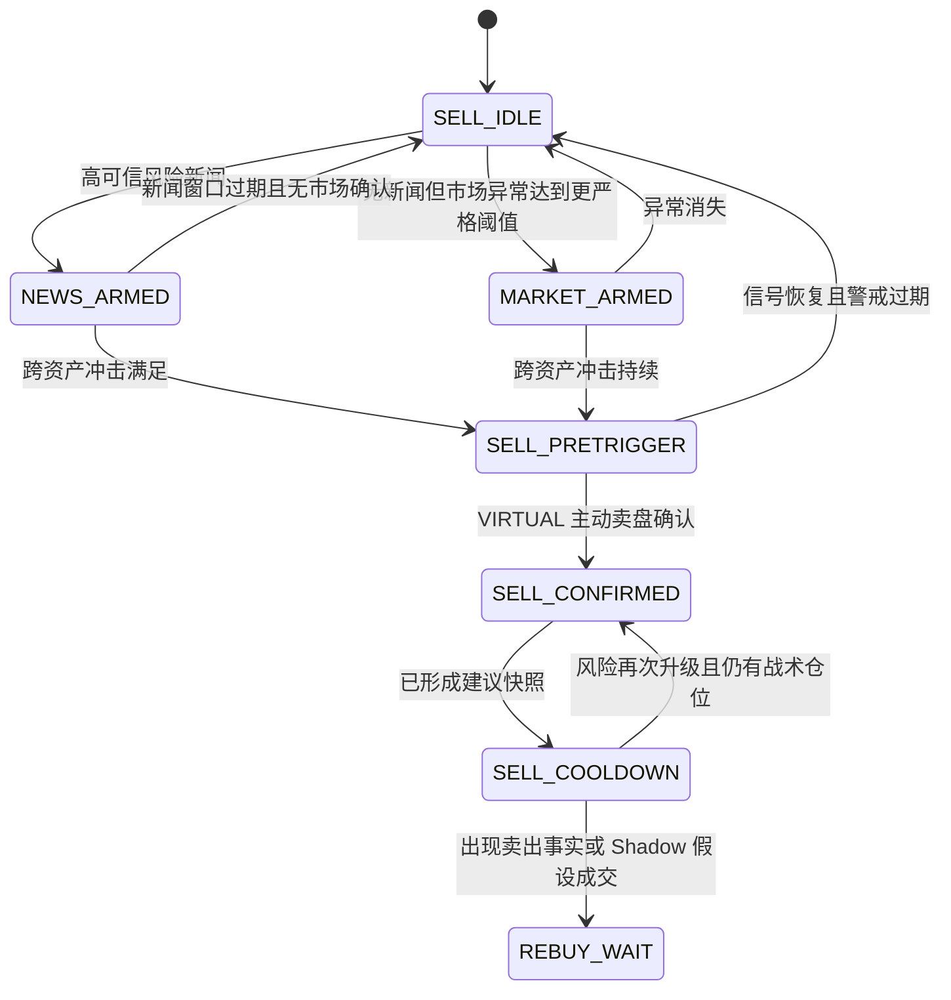
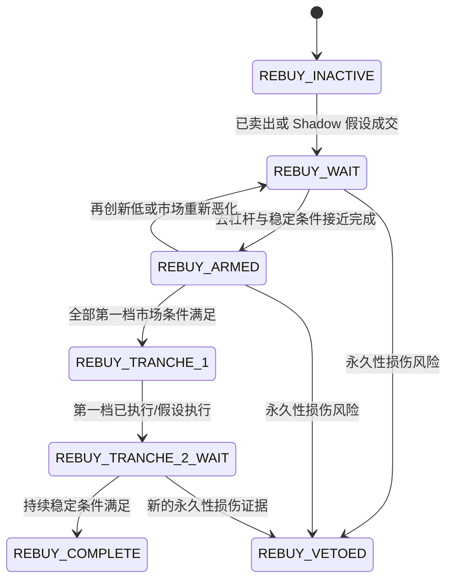
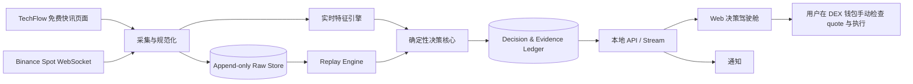

# VIRTUAL 事件驱动风险规避与回补决策系统——详细需求方案

> 文档状态：需求基线 v0.3（最小双源路径）+ v0.2 历史实现证据  
> 编制日期：2026-08-22；产品方向修订：2026-08-23（Asia/Shanghai）  
> 目标资产：VIRTUAL  
> 已知 Base 合约：`0x0b3e328455c4059eeb9e3f84b5543f74e24e7e1b`  
> 目标持仓形态：DEX 钱包持仓；链不进入监测和决策模型  
> 当前证据结论：`POSITIVE_EV_NOT_PROVEN`  
> 当前开发边界：已实现的 Base/RPC/DEX quote 垂直切片只保留为 v0.2 历史研究证据，不再进入 v0.3 活跃产品路径；v0.3 只读输入限定为 TechFlow 免费公开快讯与 Binance 实时市场数据，不签名、不广播。

> **2026-08-22 验证更正：** 原草案中 `13:05:01` 预触发、`13:07:13` 确认、`13:20`–`13:29:44` 回补两档及 `+8.798%` 反事实是待验假设，已被 received-time-only 公开数据回放证伪。本文以第 13 章更正后时间线为准；任何未被替换的旧示例均不得作为验收结论。

> **2026-08-23 产品方向覆盖：** 本文 v0.2 中关于多层新闻源、第二交易所、衍生品、RPC、链上监听、钱包余额、DEX quote 和每链可执行性的产品要求均已退出 v0.3 活跃范围。它们仍可作为历史研究记录，但不得继续生成实现任务、阻止状态或 UI 条件。发生冲突时，以第 0A 章和第 28 章的 v0.3 定义为准。

---

## 0A. 2026-08-23 权威产品基线：最小双源路径

### 0A.1 唯一运行链路

```text
TechFlow 免费 7×24h 快讯 ─┐
                           ├─ 规范化 → 确定性 Sell/Rebuy 状态机 → 进度条/通知
Binance 实时市场 WebSocket ─┘
                                                    ↓
                                      用户在自己的 DEX 钱包手动执行
```

v0.3 只有两个外部输入：

1. **唯一新闻源：** TechFlow `https://www.techflowpost.com/newsletter` 免费公开页面；
2. **唯一市场源：** Binance Spot WebSocket 的 `BTCUSDT / ETHUSDT / SOLUSDT / VIRTUALUSDT`。

不接入第二新闻源、第二交易所、付费源、X、Telegram、CoinGlass、衍生品、RPC、链上事件、钱包余额或 DEX quote。若单一来源不可用，系统必须显示 `DATA_UNAVAILABLE`，不能静默使用旧数据或隐藏降级。

### 0A.2 TechFlow 接入边界

截至 2026-08-23，TechFlow 官方公开 `7×24h 快讯` 页面可直接访问，并在页面上标注“自动刷新”；页面同时出现加密、股市和宏观类快讯。尚未核实到官方 RSS 或开放 API，因此 capability 必须登记为：

```text
access_method = PUBLIC_WEBPAGE
cost = FREE
official_api = NOT_VERIFIED
rss = NOT_VERIFIED
availability_sla = NONE
license_for_redistribution = NOT_VERIFIED
```

实现只允许保守读取公开快讯列表，保存决策所需的标题、快讯时间、详情 URL、原始链接、必要正文、接收时间和内容 hash；不做全站抓取、私有接口逆向、登录绕过或正文再分发。页面结构、协议或访问条件变化时，状态变为 `UNSUPPORTED/REVIEW_REQUIRED`，不得悄悄换用其他新闻源。

### 0A.3 全球宏观而非国家白名单

加拿大关税事件只是回放样本，不是架构模板。TechFlow 快讯进入统一事件分类，不按国家分别建设 adapter：

- `MONETARY_MACRO`：央行、利率、通胀、就业、增长；
- `TRADE_SANCTIONS`：关税、贸易摩擦、制裁、出口管制；
- `GEOPOLITICS`：战争、军事升级、政府危机；
- `FINANCIAL_STABILITY`：银行、流动性、信用和市场基础设施；
- `ENERGY_SUPPLY`：石油、能源、供应链与重大灾害；
- `CRYPTO_POLICY`：加密监管、稳定币和大型金融机构政策；
- `OTHER/UNKNOWN`：无法安全归类的事件。

最小新闻字段为：`source_item_id / source_url / source_occurred_at / received_at / headline / body_excerpt / source_attribution / event_type / entities / countries / direction / severity / scheduled_state / raw_text_hash`。国家只是事件实体数组，不影响 adapter 拓扑。

### 0A.4 最小卖出路径

正常路径：

```text
MACRO_SHOCK
AND CROSS_ASSET_DRAWDOWN
AND VIRTUAL_RELATIVE_WEAKNESS
AND VIRTUAL_SELL_PRESSURE
→ SELL_READY
```

其中：

- `MACRO_SHOCK` 只能由新鲜、相关、方向明确的 TechFlow 快讯武装，不能单独卖出；
- 其余三个条件只由 Binance 数据计算；
- 新闻缺失或 TechFlow 故障时，仅允许预定义的 `EXTREME_MARKET_BREAKDOWN` 更严格备用路径；
- 极端阈值在历史回放完成前保持 `UNKNOWN`，不得凭主观数字上线。

### 0A.5 最小买回路径

买回只保留：

```text
NO_NEW_MACRO_ESCALATION
AND CROSS_ASSET_NO_NEW_LOW
AND VIRTUAL_RELATIVE_RECOVERY
AND VIRTUAL_SELL_PRESSURE_NORMALIZED
→ REBUY_READY
```

没有实际卖出或明确的 Shadow 假设卖出时，只展示恢复进度，不建议增加原有仓位。买回、卖出都不依赖 OI、清算、RPC、DEX 池或链状态。

### 0A.6 输出与经济边界

- 系统输出的是参考市场决策信号，不是 DEX 成交保证；
- 用户在 DEX 钱包看到的即时 quote 才是执行时价格；
- 系统不得显示链级 `ACTIONABLE`、预计成交数量、滑点、Gas 或链上收益；
- 历史评估统一使用 `CEX_REFERENCE`，并明确不等于真实成交；
- 在足够历史样本和 Shadow 证据形成前继续显示 `POSITIVE_EV_NOT_PROVEN`。

### 0A.7 最小 UI

首页只展示：

1. TechFlow 新闻源健康与最近一条相关宏观事件；
2. Binance 市场源健康；
3. 卖出进度：宏观事件、跨资产下跌、VIRTUAL 相对弱势、主动卖压；
4. 买回进度：无新升级、无新低、相对恢复、卖压归一；
5. 用自然中文表达的当前结论、已满足数量、条件进度和“最关键还差什么”。

不显示链、钱包、RPC、DEX quote、衍生品、多来源传播层级或综合概率。

读者界面不得直接显示 `SHADOW/CEX_REFERENCE/STAGE/OUTPUT/PASS/FAIL/UNKNOWN/STALE`、transport、capability、source ID、evidence ID 等后台原生字段。它们继续保留在 API、日志、测试和证据层，用于审计与故障定位；前端只显示不改变业务含义的中文结论。每项条件默认只回答“现在怎样、完成多少、还差什么”，不把阈值表、来源年龄和证据哈希铺在首屏。

---

## 0. 文档目的与使用方式

本文档是该项目的第一份产品、数据、模型、交互、工程与验收基线，用来确认我们对需求的理解是否完整，并约束后续开发不偏离目标。

本文档回答以下问题：

1. 系统真正要帮助用户做什么决策；
2. 为什么不能把它简单做成“抓到负面新闻就卖”的机器人；
3. TechFlow 新闻与 Binance 行情分别承担什么作用；
4. 如何让用户用进度条明确看到“已经满足什么、还差什么”；
5. 如何把卖出和买回拆成两个可审计、可回放、可证伪的决策模型；
6. 如何让链与钱包完全退出监测热路径，由用户在 DEX 钱包完成最终执行；
7. 如何先通过历史回放和实时 Shadow 验证，而不是未经证明就自动交易；
8. 哪些产品方向、成本、风险和数据选择仍需用户决策。

除“待决策事项”外，文档中的参数均属于**推荐的初始研究参数**，不是已经证明可盈利的生产参数。后续必须用无未来函数的历史回放和实时 Shadow 数据校准。

---

## 1. 对全部需求的统一理解

### 1.1 用户真正需要的产品

用户需要的不是一个新闻阅读器，也不是另一个鲸鱼监控产品，而是一个面向 VIRTUAL DEX 持仓、但不连接钱包或链的“风险减仓—恐慌消化—分批买回”决策驾驶舱。

它需要在突然下跌时连续回答两个彼此独立的问题：

1. **卖出问题：此刻是否应该减少战术仓位中的 VIRTUAL？**
2. **买回问题：此前卖出后，此刻是否已经满足分批买回条件？**

系统必须实时展示：

- 当前处于哪个阶段；
- 每个必要条件的当前值、目标值与差距；
- 哪些条件已经通过，哪些仍未通过，哪些因为无数据而处于 `UNKNOWN`；
- 数据是否新鲜；
- 如果可以行动，是“等待”“卖出第一档”“卖出第二档”“买回第一档”还是“买回第二档”；
- 该判断使用了哪些证据，以及之后能否完整回放。

### 1.2 数据与新闻的关系

系统采用“**Binance 市场数据负责确认，TechFlow 新闻负责宏观武装**”的原则：

- TechFlow 快讯可以更早把系统置为宏观风险警戒状态；
- 新闻本身不直接授权卖出；
- 即使还没有捕获新闻，当跨资产价格与成交方向出现足够强的同步异常时，系统也应能够以更严格阈值进入 `MARKET_ARMED`；
- 正常卖出建议必须同时具备宏观快讯与 Binance 市场确认；
- TechFlow 不可用时，只允许更严格的极端市场备用路径；
- VIRTUAL 特定快讯可阻止买回，但不能单独授权卖出。

### 1.3 钱包执行与数据分析的关系

Base Chain 和 Robinhood Chain 都不进入监测或决策核心。正确结构是：

```text
TechFlow 快讯 + Binance BTC/ETH/SOL/VIRTUAL
                    ↓
          卖出/买回参考信号
                    ↓
          用户选择自己的 DEX 钱包
                    ↓
        以钱包当时 quote 决定是否执行
```

系统只回答市场是否正在发生或消化冲击；链、路由、滑点和最终成交由用户使用的 DEX 钱包处理。

### 1.4 明确排除的产品边界

- 不读取、不依赖、不改造 `Virtuals Whale Radar`；
- 不把 CEX 余额或 CEX 下单作为持仓与执行路径；
- 不把 Binance 参考价冒充 DEX 实际成交价；
- 不连接 RPC、钱包、链上索引器或 DEX quote API；
- 不把其他免费媒体、社交源或第二交易所偷偷作为备用源；
- 不承诺低买高卖一定盈利；
- 第一阶段不保存私钥、不签名、不广播交易；
- 不让 LLM 进入毫秒级决策热路径；
- 不把一个综合进度百分比解释为“成功概率”或“盈利概率”；
- 不把缺失数据静默当作 0 或条件未满足。

---

## 2. 产品目标、非目标与成功定义

### 2.1 核心目标

建立一个本地优先、可回放、可审计、只依赖 TechFlow 与 Binance 的决策系统，使用户在 VIRTUAL 遭遇突发市场冲击时能够：

1. 比仅凭肉眼看新闻更早、更一致地识别风险升级；
2. 看清卖出与买回分别满足了哪些条件；
3. 避免在只有新闻、没有市场确认时误卖；
4. 避免在恐慌尚未消化或资产出现永久性损伤时过早买回；
5. 由用户在自己的 DEX 钱包检查即时 quote 并决定是否执行；
6. 通过回放和 Shadow 数据证明或推翻参考信号优势。

### 2.2 经济目标

系统优化的不是“交易次数”或“猜中新闻”，而是：

```text
在不扩大长期风险敞口的前提下，
最大化一次完整卖出—买回循环后持有的 VIRTUAL 净数量，
同时控制误卖、踏空、滑点、Gas、路由失败、数据未知与回补失败的尾部风险。
```

v0.3 不采集真实 DEX 可执行价格，因此一轮完整循环只计算明确标注的 CEX 参考反事实：

```text
reference_sell_proceeds
= virtual_sold × Binance reference sell price

reference_rebought_virtual
= reference_sell_proceeds / Binance reference buy price

reference_token_quantity_delta
= reference_rebought_virtual - virtual_sold
```

该结果不能写成真实收益、可实现收益或成交回执。Gas、滑点、路由费和人工反应会使真实结果更差，但 v0.3 不猜测这些数值。

### 2.3 产品成功标准

产品成功需要同时满足三层：

1. **正确性成功**：数据、状态、进度、参考价格与真实执行边界不混淆；`UNKNOWN` 不被伪装；回放没有未来函数。
2. **操作成功**：用户能在一个页面内理解当前阶段、满足条件、缺口和两条输入源的健康状态。
3. **经济成功**：在足够样本的回放和 Shadow 中，参考信号相对不交易基线表现稳定；真实 DEX 经济性仍需用户执行记录才能证明。

在第 3 层得到证据前，状态始终是 `POSITIVE_EV_NOT_PROVEN`。

### 2.4 非目标

- 不做全币种自动量化交易平台；
- 不做 VIRTUAL 项目基本面研究终端；
- 不做鲸鱼地址画像或跟单系统；
- 不做新闻摘要产品；
- 不在第一版构建自动签名器、自动授权或无人值守资金执行器；
- 不把回测最优参数直接上线；
- 不以单次 2026-08-22 事件作为盈利证明。

---

## 3. 第一性原理与可证伪的优势假说

### 3.1 机会从哪里来

潜在收益不是由新闻本身支付，而可能来自不同市场参与者的反应速度与被迫去杠杆的时间差：

```text
外部冲击或宏观风险
  → BTC/主流资产先出现方向变化
  → 高 Beta 资产与高杠杆仓位被动去杠杆
  → VIRTUAL 主动卖盘与流动性恶化加速
  → 恐慌与强平逐步被消化
  → 订单流、跨资产稳定性和流动性恢复
```

如果这条传播链在足够多事件中存在稳定的先后关系，并且信号领先时间大于 TechFlow 接收、计算、通知和人工打开钱包的总延迟，那么系统可能形成可执行优势。

### 3.2 信号梯级

本系统使用以下信号梯级，但不把它们机械串成全部必须满足的 `AND`：

| 层级 | 信号 | 作用 | 是否直接触发行动 |
|---|---|---|---|
| S0 | 事后结果：实际低点、后续反弹、真实成交回执 | 复盘与对账 | 否 |
| S1 | TechFlow 快讯首次被系统收到 | 风险上下文、提前警戒 | 否 |
| S2 | 跨资产同步异常：BTC/ETH/SOL/VIRTUAL | 发现市场已开始定价 | 可以进入预触发 |
| S3 | VIRTUAL 主动卖盘与相对弱势 | 确认本资产正在被抛售 | 可以确认卖出阶段 |
| S4 | 无新低、订单流回正、主流资产稳定 | 判断冲击是否被消化 | 可以启动买回阶段 |
| S5 | 用户在 DEX 钱包查看即时 quote | 用户自行决定是否执行 | 系统外人工步骤 |

### 3.3 可控优势

可控优势按优先级分为：

1. **信息优势**：以 TechFlow 一个免费公开快讯入口获得足够的宏观与加密风险上下文；
2. **决策优势**：预先定义状态与阈值，不在恐慌时临时凭感觉判断；
3. **执行纪律优势**：将判断提前做成进度条件，收到提示后由用户在钱包检查 quote；
4. **证据边界优势**：始终把 Binance 参考信号与 DEX 真实成交分开；
5. **学习优势**：保存当时可见数据，重复回放，识别误卖、迟卖、早买和迟买原因。

第一版不声称具有链上排序或抢跑优势，也不依赖更高 Gas 形成竞争优势。

### 3.4 推翻优势假说的证据

出现以下任一结果时，应降低策略信任、重新设计或选择 `NO_ACTION`：

- 多数事件中 BTC/SOL/VIRTUAL 的领先顺序不稳定；
- 有效信号出现时，VIRTUAL 已完成主要跌幅，剩余机会不足以覆盖成本；
- 用户实际 DEX 执行结果长期显著差于 CEX 参考反事实；
- 误卖后快速反弹造成的踏空损失高于成功规避的收益；
- 买回条件只能事后识别，实时没有可用的领先性；
- 新闻聚类增加噪声却没有提高风险识别；
- 30 个相似事件及 14 天 Shadow 后，参考 token quantity delta 不优于不交易；
- TechFlow 延迟、Binance 数据缺失或人工反应延迟使理论优势无法执行。

### 3.5 行动必须优于“不交易”

系统不能因为条件上已触发就默认应该交易。每个参考行动信号必须与 `NO_ACTION` 比较：

```text
U(reduce_now)
= expected_avoided_drawdown
+ expected_rebuy_quantity_gain
- false_exit_and_rebound_cost
- sell_and_rebuy_execution_cost
- missed_reentry_cost
- data_unknown_penalty

U(no_action)
= expected_hold_outcome
- hold_tail_risk

live_action_eligible
= lower_confidence_bound(U(reduce_now) - U(no_action))
   > decision_margin
```

在样本不足、概率未校准时，上述效用必须显示为 `UNKNOWN`，不能填入主观概率。系统此时仍可输出 `SIGNAL_READY` 和完整条件进度，用于回放/Shadow；但不能把它升级为“已证明具有正期望的实盘建议”。

因此产品并排展示三类状态：

1. **信号状态**：宏观与市场条件是否满足；
2. **数据状态**：TechFlow 与 Binance 是否新鲜、完整；
3. **经济状态**：CEX 参考反事实相对不交易是否已有足够证据。

即使三者通过，v0.3 也只显示 `REFERENCE_SIGNAL_READY`；DEX 执行判断始终留给用户钱包。验证阶段使用 `SHADOW_CANDIDATE`。

---

## 4. 用户、使用场景与操作模式

### 4.1 目标用户

第一版只有一个主要用户：持有 Base 和/或 Robinhood Chain 上 VIRTUAL 的钱包所有者，希望管理一部分战术仓位，同时保留长期核心仓位。

### 4.2 典型场景

#### 场景 A：先有新闻，市场尚未下跌

- TechFlow 出现新鲜、相关的宏观负面快讯；
- 状态进入 `NEWS_ARMED`；
- 页面显示事件类型、影响范围与观察窗口；
- 不建议卖出，等待跨资产与 VIRTUAL 订单流确认。

#### 场景 B：没有捕获新闻，但市场突然同步下跌

- BTC、ETH、SOL、VIRTUAL 在短窗内出现异常同步下跌；
- 使用比“有新闻模式”更严格的阈值进入 `MARKET_ARMED`；
- 如果 VIRTUAL 主动卖盘和相对弱势同时达到极端阈值，进入参考卖出候选；
- TechFlow 继续恢复，但系统不切换到其他新闻来源。

#### 场景 C：参考信号满足，但用户钱包 quote 不理想

- 系统模型进入 `SELL_READY`；
- 页面明确提示该状态只基于 Binance；
- 用户打开自己的 DEX 钱包检查 quote、滑点、Gas 和路由；
- quote 不理想时用户不执行，系统不推断成交，也不把信号冒充为可实现收益。

#### 场景 D：跌幅很大，但仍在创新低

- 主流资产或 VIRTUAL 继续刷新低点；
- 买回进度条中的“无新低”重置为 0；
- 系统保持 `REBUY_WAIT`，不因价格看起来便宜而买回。

#### 场景 E：VIRTUAL 出现永久性损伤

- TechFlow 出现 VIRTUAL 资产特定的严重风险快讯；
- 买回状态进入 `UNKNOWN_REVIEW_REQUIRED`；
- 页面要求人工复核，不允许其他正向条件自动抵消；
- 由于没有链上或官方第二来源，系统不得把该候选自动升级成已验证事实。

### 4.3 产品运行模式

| 模式 | 数据 | 决策输出 | 钱包/链能力 | 用途 |
|---|---|---|---|---|
| `REPLAY` | 历史 TechFlow/Binance | 历史时点重算的 `CEX_REFERENCE` | 无 | 研究与回归测试 |
| `SHADOW` | 实时 TechFlow/Binance | 实时参考候选并记账 | 无 | 验证策略与延迟 |
| `LIVE_READ_ONLY` | 实时 TechFlow/Binance | 参考信号与通知 | 无；用户另开 DEX 钱包 | 用户人工判断与操作 |

第一版交付上述三种只读模式，且 `LIVE_READ_ONLY` 与 `SHADOW` 可以同时运行。`PREPARE_ONLY/AUTO_EXECUTE` 不在 v0.3 路线图中。

---

## 5. 产品范围与关键假设

### 5.1 第一版必须覆盖

- VIRTUAL 单资产；
- BTC、ETH、SOL、VIRTUAL 的实时市场数据；
- TechFlow 免费 `7×24h 快讯` 单源采集、去重和全球事件规范化；
- Binance Spot 单源的主动买卖、跨资产与相对强弱特征；
- 卖出与买回两套状态机；
- 条件进度条、当前值、阈值、差距、趋势、数据新鲜度；
- 历史时间线与可重复回放；
- Shadow 决策账本；
- 通知与证据快照；
- 配置版本化。

### 5.2 当前已知与未知

| 项目 | 当前状态 | 处理原则 |
|---|---|---|
| TechFlow 免费快讯页 | `PUBLIC_WEBPAGE / VERIFIED_CURRENT` | 没有已验证 RSS/API/SLA；保守读取，变化时 fail-visible |
| Binance Spot | 官方 WebSocket 已复核 | v0.3 唯一市场源；断流时显示数据不可用，不接第二交易所兜底 |
| 战术仓位占总 VIRTUAL 比例 | `UNSET` | 页面使用比例场景；未设置前不给绝对数量建议 |
| RPC/链/钱包/DEX quote | `OUT_OF_SCOPE` | v0.2 证据保留，但不进入 runtime、UI 或 gate |
| 其他新闻源、第二交易所和付费源 | `OUT_OF_SCOPE` | 不预留 live fallback；未来变更必须重新决策 |
| 盈利优势 | 未证明 | 先回放、再 Shadow，不进入自动执行 |

### 5.3 时间标准

- 内部一律保存 UTC；
- UI 默认显示 Asia/Shanghai，并可切换 UTC；
- 每条数据至少记录 `source_occurred_at`、`received_at`、`normalized_at`；
- 只有源不提供发生时间时，`source_occurred_at` 才为 `UNKNOWN`；
- 不用日志打印时间猜测新闻原始发布时间；
- 进程需监测系统时钟偏差。

---

## 6. 新闻信息分布与采集方案

> **v0.3 活跃规则：** 唯一运行新闻源是 TechFlow 免费 `7×24h 快讯` 公开页面。下文保留的来源层级仅用于解释历史 fixture 和未来研究，不是实现清单，不能生成 T0/T1/T3/T4 adapter。

### 6.1 v0.3 为什么只保留 TechFlow

目标不是构建全球新闻数据库，而是在零订阅成本下获得足以武装市场判断的宏观与加密快讯。TechFlow 已把多个上游来源汇总到一个公开的 `7×24h 快讯` 页面，v0.3 接受其覆盖和延迟限制，以显著降低 adapter、许可、去重和运维复杂度。

该选择的代价必须显式保留：TechFlow 可能晚于原始通讯社、漏报、修改页面或停止免费访问；因此新闻不能单独触发卖出，且极端市场备用路径不能依赖 TechFlow 正常运行。

### 6.2 新闻源层级（v0.2 历史研究索引，非活跃接入）

| 层级 | 来源类型 | 例子 | 主要价值 | 主要风险 | 默认作用 |
|---|---|---|---|---|---|
| T0 | 官方与链上原始事实 | 政府/监管/央行/项目公告、状态页、链上事件 | 权威、可复核 | 语言生硬、发布慢或入口分散 | 事实确认、永久损伤判断 |
| T1 | 综合新闻社/财经快讯 | AP、Reuters 类、宏观快讯服务 | 较快且覆盖宏观 | 许可/成本、转述误差 | 风险警戒 |
| T2 | 加密专业媒体 | TechFlow、CoinDesk、The Block 类 | 加密语境与传播 | 可能二次转述 | 聚类与资产相关性 |
| T3 | 高传播社交账号 | 官方 X、记者、WatcherGuru、Unusual Whales | 传播速度和市场注意力 | 噪声、断章取义、重复 | 放大度、传播时间线 |
| T4 | 社区/匿名来源 | Telegram、Discord、一般账号 | 可能更早 | 可信度低、操纵风险 | 只作软信号与待核实线索 |

上述层级只用于解释历史数据来自哪里；v0.3 不为它们建设 adapter，也不在 UI 展示多来源完成度。

### 6.3 新闻主题分类

每个事件聚类至少分类为：

- `MACRO_POLICY`：关税、贸易、利率、财政、资本管制；
- `GEOPOLITICS`：战争、制裁、军事升级；
- `REGULATION`：加密监管、执法、证券认定；
- `MARKET_INFRASTRUCTURE`：交易所、做市、清算、稳定币、托管；
- `CHAIN_SECURITY`：链停摆、桥攻击、共识异常；
- `PROTOCOL_SECURITY`：合约漏洞、黑客、权限滥用；
- `TOKEN_SPECIFIC`：VIRTUAL 发行、解锁、团队、流动性、下架、治理；
- `LIQUIDITY_CREDIT`：流动性危机、信用风险、强平连锁；
- `RUMOR_UNVERIFIED`：未经确认的传闻；
- `OTHER`。

### 6.4 单源事件规范化与去重

运行时只处理 TechFlow。同一快讯因列表刷新、详情修改或重复发布而多次出现时，不能被计为多个独立负面事件。AP、金十、X 等只存在于历史 fixture，不是 live 来源。

每条原始观察保存：

```text
source_id
source_tier
source_item_id
source_url
source_occurred_at
received_at
language
raw_text_hash
entities
claim_fingerprint
credibility_state
```

事件聚类使用：

```text
cluster_key
= 关键实体 + 规范化主张 + 时间窗 + 事件类型
```

一个聚类保存：

- TechFlow 首次出现时间；
- 最早被系统接收时间；
- TechFlow 标注的上游归因与原始链接（若有）；
- revision 与重复关系；
- 严重度；
- 影响范围；
- 是否为 VIRTUAL 特定永久性风险；
- 置信状态 `VERIFIED / PLAUSIBLE / UNVERIFIED / DISPUTED / UNKNOWN`。

#### 6.4.1 事实置信、市场严重度与传播热度必须分开

三个维度不能揉成一个“新闻分数”：

```text
fact_confidence
= VERIFIED | PLAUSIBLE | UNVERIFIED | DISPUTED | UNKNOWN

market_severity
= LOCAL | SECTOR | CRYPTO_WIDE | GLOBAL_RISK

attention_state
= QUIET | SPREADING | SATURATED | FADING | UNKNOWN
```

- 事实置信回答“这件事是否真实”；
- 市场严重度回答“如果为真，可能影响多大范围”；
- 传播热度回答“市场参与者此刻是否正在注意它”。

同一 TechFlow 快讯重复出现不能提高事实置信或严重度；若 Binance 市场没有确认，它仍不能触发卖出。

新闻结构化可使用规则、实体识别和 LLM 辅助，但 LLM 只在异步信息路径中工作：

- 不持有任何钱包权限；
- 不直接改变交易阶段；
- 输出必须带原始来源引用；
- 对永久损伤只能提出候选风险，最终 `FAIL` 需由预定义规则、强来源或人工复核确认；
- LLM 超时或不可用不阻止 market-only 数据路径。

### 6.5 新闻对决策的权限

新闻只允许产生以下作用：

- 进入 `NEWS_ARMED`；
- 调整市场信号的敏感度档位；
- 提供解释与证据；
- 将 VIRTUAL 特定风险标为买回复核候选；
- 触发人工关注或通知。

新闻不得单独产生：

- `SELL_CONFIRMED`；
- `REBUY_CONFIRMED`；
- 盈利概率；
- 自动交易授权。

### 6.6 新闻延迟与成本指标

每个源需统计：

- 原始事件时间到源发布时间；
- 源发布时间到系统接收时间；
- 对已知历史事件的覆盖率；
- 重复率；
- 误报率与撤稿率；
- 对实际市场冲击的领先/滞后分布；
- 公开页面读取成本、可用性与访问限制。

v0.3 不评估或预留付费新闻 adapter；若未来要更换新闻源，必须作为新的产品决策整体替换 TechFlow，而不是继续叠加来源。

---

## 7. 市场数据方案

> **v0.3 活跃规则：** 只接 Binance Spot；衍生品、OI、清算、RPC、钱包和 DEX quote 全部退出运行范围。相关历史章节仅用于解释 v0.2 已有证据。

### 7.1 CEX 参考市场数据

第一版核心资产：

- `BTCUSDT`；
- `ETHUSDT`；
- `SOLUSDT`；
- `VIRTUALUSDT`。

需要的数据：

- 成交级/聚合成交级价格与数量；
- 主动买/主动卖方向；
- 最优买卖价；
- 可选的前若干档深度；
- 1 秒、5 秒、15 秒、30 秒、60 秒、5 分钟滚动收益；
- 窗口内高低点、回撤、波动率与成交量异常；
- 数据序号、断线与补洞状态。

Binance 是 v0.3 唯一参考源。adapter 仍输出规范化对象，避免业务公式直接读取供应商原始字段；但当前不预留第二交易所的运行配置和 UI。

### 7.2 VIRTUAL 订单流

滚动主动买卖比：

```text
taker_buy_sell_ratio(window)
= sum(taker_buy_quote_notional)
  / max(sum(taker_sell_quote_notional), epsilon)
```

同时展示：

- 主动买入名义金额；
- 主动卖出名义金额；
- 买卖比；
- 净主动流；
- 与过去相同时段基线的 z-score；
- 数据覆盖率。

若使用 Binance `aggTrade`，必须按官方语义正确解释 maker 标记，并用 `price × quantity` 计算名义金额。回放与实时必须使用同一实现。

### 7.3 衍生品数据（v0.2 历史设计，v0.3 不采集）

核心字段：

- `open_interest_contracts`；
- `open_interest_usd`；
- OI 5 分钟、10 分钟、20 分钟变化；
- 多空持仓比；
- 主动买卖比；
- 强平方向与名义金额（若有可靠实时源）；
- 资金费率与基差（辅助，不作短秒级硬条件）。

注意：OI 的 API 频率通常低于成交数据，因此：

- 卖出热路径不能等待下一根 5 分钟 OI；
- OI 更适合买回阶段判断杠杆是否被冲洗；
- OI 过期时应显示 `UNKNOWN/STALE`，不得沿用为新鲜确认。

### 7.4 DEX 与链上数据（v0.2 历史设计，v0.3 不采集）

每条链需要独立采集：

- chain ID 与最新区块；
- VIRTUAL 精确资产身份；
- 结算资产身份；
- 钱包 VIRTUAL 与结算资产余额；
- 可用池与路由；
- 指定数量的卖出报价；
- 使用卖出所得的买回报价；
- 价格影响；
- 最低可得数量；
- 路由费、协议费与预计 Gas；
- 报价所基于的区块与过期时间；
- 路由/模拟失败原因；
- allowance 只读状态（第一版不发起授权）。

### 7.5 数据新鲜度初始要求

以下是待 Shadow 验证的初始运行目标：

| 数据 | 期望频率 | `STALE` 初始阈值 | 过期后的行为 |
|---|---:|---:|---|
| CEX 成交/最优价 | 流式 | 3 秒 | 阻止新行动建议 |
| VIRTUAL 订单流 | 1 秒滚动 | 3 秒 | 阻止卖出确认与买回确认 |
| BTC/ETH/SOL 跨资产特征 | 1 秒滚动 | 3 秒 | 阻止市场确认 |
| TechFlow 快讯列表 | 保守轮询，初始 10 秒 | 30 秒未成功刷新则显示降级；阈值待 soak 修订 | 正常新闻路径不可确认；极端市场备用路径保留 |

阈值必须配置化、版本化，并通过真实延迟分布修订。

### 7.6 数据质量状态

所有关键字段使用：

```text
KNOWN(value, observed_at, expires_at, evidence_ids)
UNKNOWN(reason, since, retry_after)
UNSUPPORTED(reason)
ERROR(reason, retryable)
```

不允许：

- `UNKNOWN = 0`；
- `ERROR = FAIL`；
- 旧报价仍显示绿色；
- 任一唯一数据源断线后继续给出无警告的正常路径建议；
- 用 Binance 参考价冒充 DEX 可执行报价或真实成交。

---

## 8. 规范化数据模型

> 第 8–27 章保留了 v0.2 的 schema、回放、工程和验收证据。v0.3 只复用与 TechFlow、Binance、Sell/Rebuy、进度条、回放和只读 API 直接相关的子集；凡涉及衍生品、OI、RPC、链、钱包、DEX quote、多新闻源或链级 actionable 的字段与任务均为历史兼容，不得进入 v0.3 runtime。详细活跃任务以 `docs/todo.md` 顶部 v0.3 清单为准。

### 8.1 `NewsObservation`

| 字段 | 定义 | 单位/类型 | 决策用途 | 缺失规则 |
|---|---|---|---|---|
| `source_id` | 来源稳定标识 | string | 来源质量与延迟统计 | 必填 |
| `source_item_id` | 来源内唯一 ID | string | 去重 | 无 ID 时由规范化 URL+哈希生成 |
| `source_occurred_at` | 来源声称的发布时间 | timestamp | 首发与延迟 | 不可推断时 `UNKNOWN` |
| `received_at` | 系统首次收到时间 | timestamp | 实际可用信息边界 | 必填 |
| `raw_text_hash` | 原文哈希 | hash | 审计与去重 | 必填 |
| `claim_fingerprint` | 规范化主张指纹 | hash/string | 事件聚类 | 解析失败则 `UNKNOWN`，不阻止原文保存 |
| `credibility_state` | 来源级可信状态 | enum | 聚类置信度 | 默认 `UNKNOWN` |
| `entities` | 国家、机构、资产、协议等 | list | 影响范围 | 解析失败为空但标注覆盖缺失 |

### 8.2 `MarketObservation`

| 字段 | 定义 | 单位/类型 | 决策用途 | 缺失规则 |
|---|---|---|---|---|
| `instrument_id` | 规范化交易对 | string | 跨源对齐 | 必填 |
| `event_time` | 成交/盘口事件时间 | timestamp | 窗口计算 | 必填 |
| `received_at` | 本地收到时间 | timestamp | 延迟/回放边界 | 必填 |
| `price` | 成交或中间价 | decimal string | 收益/回撤 | 缺失则丢弃该记录并记质量错误 |
| `quantity` | 成交数量 | decimal string | 订单流 | 缺失则不能进入订单流 |
| `taker_side` | 主动方 | BUY/SELL/UNKNOWN | 买卖比 | 未知时仅进入价格序列 |
| `sequence` | 源序号 | string | 断线补洞 | 无序号需用时间+ID去重 |

### 8.3 `FeatureSnapshot`

每秒生成并保存一个版本化快照，包含：

- BTC/ETH/SOL/VIRTUAL 多窗口收益；
- 多窗口最大回撤；
- VIRTUAL 主动买卖比；
- VIRTUAL 净主动流；
- 市场宽度；
- 波动率归一化值；
- OI 变化与年龄；
- 新闻警戒状态；
- 数据完整性与 freshness；
- 模型版本；
- 证据引用。

### 8.4 `ChainQuote`

| 字段 | 定义 |
|---|---|
| `chain_profile_id` | Base 或 Robinhood 的版本化网络配置 |
| `side` | SELL_VIRTUAL / BUY_VIRTUAL |
| `amount_in` | 本次战术分档的输入数量 |
| `expected_out` | 路由预期输出 |
| `minimum_out` | 给定保护参数的最小输出 |
| `price_impact_bps` | 与路由基准价格相比的价格影响 |
| `route_fees` | 聚合器/池/协议费用 |
| `estimated_gas` | 预计 Gas，带计价币种 |
| `effective_price` | 扣除可量化成本后的有效价格 |
| `route_id` | 路由标识与版本 |
| `block_number` | 报价区块 |
| `observed_at/expires_at` | 报价新鲜度 |
| `simulation_state` | PASS/FAIL/UNKNOWN/UNSUPPORTED |
| `evidence_ids` | 可审计引用 |

### 8.5 `ConditionEvaluation`

```text
condition_id
model_id
model_version
raw_value
normalized_progress = [0, 1] | UNKNOWN
target_operator
target_value
gap_to_target
state = PASS | FAIL | UNKNOWN | STALE | VETO
observed_at
expires_at
reason
evidence_ids
```

### 8.6 `DecisionSnapshot`

```text
decision_id
mode = REPLAY | SHADOW | LIVE_READ_ONLY
model = SELL | REBUY
stage
stage_entered_at
conditions[]
passed_required_count
required_count
hard_gates[]
chain_executability[]
recommended_action
recommended_fraction_of_tactical_sleeve
absolute_amount = KNOWN | UNKNOWN
data_health
model_version
evidence_ids
created_at
```

---

## 9. 决策模型总原则

### 9.1 必须拆成两个模型

卖出与买回不能共享一个总分：

```text
Sell Model：判断风险是否正在快速扩散，是否应该减少战术仓位。
Rebuy Model：判断卖出后冲击是否已被吸收，是否应该重新获得 VIRTUAL 敞口。
```

卖出模型回答“风险正在恶化吗”；买回模型回答“恶化是否停止且可执行吗”。将二者混合会产生“跌得越多，既更想卖又更想买”的逻辑冲突。

### 9.2 进度不是概率

界面可显示：

- `2/4 required conditions passed`；
- 每个连续条件自己的 0–100% 目标进度；
- 当前阶段；
- 是否被硬门槛阻止。

界面不得把 `75%` 写成：

- 75% 会继续下跌；
- 75% 能盈利；
- 75% 应该卖出全部仓位。

### 9.3 硬门槛、连续条件与软信息

| 类型 | 示例 | 处理方式 |
|---|---|---|
| 正确性硬门槛 | 资产/链身份、数据新鲜度、钱包库存 | 未知或失败时阻止对应动作 |
| 策略条件 | 跨资产回撤、订单流、OI 冲洗、无新低 | 计算进度并决定阶段 |
| 执行硬门槛 | DEX 报价、价格影响、路由、链头 | 对应链不可执行 |
| 软信息 | 社交传播、新闻解释、资金费率 | 展示、调节敏感度或异步记录 |
| 永久损伤否决 | 黑客、合约/桥严重故障、不可逆下架等 | 阻止买回，需人工复核 |

### 9.4 条件分母与链状态必须明确

卖出面板的“必要条件完成数”固定按以下四项计算：

1. 风险上下文：`NEWS_ARMED` 或更严格的 `MARKET_ARMED`；
2. 跨资产冲击；
3. VIRTUAL 主动卖盘确认；
4. 当前所选链的 DEX 可执行性。

数据健康、资产身份和经济状态不放入完成数，它们以独立硬门槛显示，避免“5 个好条件抵消 1 个致命失败”。因此 Base 与 Robinhood 可能同时是 `3/4`，但第四项状态不同；也可能市场信号完全相同而链行动状态不同。

买回面板的必要条件固定为五项：

1. 无新低持续时间；
2. OI 冲洗；
3. VIRTUAL 订单流恢复；
4. BTC/SOL 跨资产稳定；
5. 当前所选链的 DEX 买回可执行性。

永久损伤、数据健康、资产身份和经济状态同样单列为硬门槛。

每条链的行动状态使用互斥枚举：

```text
SIGNAL_NOT_READY
QUOTE_PENDING
ACTIONABLE_WITH_EVIDENCE
SHADOW_CANDIDATE
BLOCKED_DATA
BLOCKED_IDENTITY
BLOCKED_COST
BLOCKED_LIQUIDITY
UNSUPPORTED
UNKNOWN
```

### 9.5 连续条件的统一进度函数

进度只描述离目标的接近程度，且公式由条件方向决定。

对“越低越满足”的条件（例如买卖比 `<= target`）：

```text
progress_down(current, neutral, target)
= clamp((neutral - current) / (neutral - target), 0, 1)
```

对“越高越满足”的条件（例如 OI 冲洗 `>= target`）：

```text
progress_up(current, neutral, target)
= clamp((current - neutral) / (target - neutral), 0, 1)
```

对同时要求数值与持续时间的条件：

```text
condition_progress
= min(value_progress, duration_progress)
```

对组合 `AND` 条件，卡片可以显示一个摘要进度，但必须同时展示每个子条件；摘要默认取子条件最小值，不能用平均值掩盖未满足项。

任何输入为 `UNKNOWN/STALE` 时，进度也是 `UNKNOWN`，不是 0%。

### 9.6 经济行动门槛

在历史回放与 Shadow 尚未完成前：

```text
economic_evidence = POSITIVE_EV_NOT_PROVEN
maximum_output = SHADOW_CANDIDATE
```

进入未来 `LIVE_READ_ONLY` 的必要条件至少包括：

- 使用留出事件而非调参事件；
- 以指定数量 DEX 报价而非 CEX 中间价计算；
- 覆盖卖出和买回两侧 Gas、路由费、价格影响与失败成本；
- 对误卖后反弹和回补失败做压力测试；
- 策略相对 `NO_ACTION` 的保守估计高于用户设定的 `decision_margin`；
- 结果不是由单一事件或单一行情状态贡献。

该门槛是 gate，不是总分中的一项负权重。

---

## 10. 卖出决策模型

### 10.1 卖出状态机



注意：第一版没有真实成交时，`SHADOW` 使用“假设按当时记录的 DEX 报价成交”的虚拟头寸；没有 DEX 报价时只能记录 `EXECUTION_UNKNOWN`，不能创建虚假 Shadow 成交。

### 10.2 风险警戒的双路径

#### 路径 A：`NEWS_ARMED`

初始建议：

- 事件聚类为 `VERIFIED` 或多个独立高质量来源达到规则；
- 严重度达到系统性市场风险阈值；
- 事件发生/接收时间在 120 分钟观察窗口内；
- 新闻重复转发不重复增加严重度。

作用：降低市场预触发所需的异常强度，但不直接建议卖出。

#### 路径 B：`MARKET_ARMED`

即使没有新闻，如果跨资产异常强度超过更严格的波动率归一化门槛，系统也进入警戒。这样可以满足“抛开负面信息，从数据侧发现”的核心要求。

作用：避免新闻采集延迟或未知原因导致系统失明。

为避免把同一条件重复计算两次，`MARKET_ARMED` 只看不含 VIRTUAL 的广泛市场异常，例如：

```text
market_shock_breadth
= count(BTC, ETH, SOL where return_60s <= strict_asset_threshold)

MARKET_ARMED
= market_shock_breadth >= configured_breadth
   AND broad_market_volume_anomaly >= configured_level
```

后续 S1 再判断 VIRTUAL 是否已经与该冲击同步，并使用较标准的跨资产条件。这样“风险上下文”和“VIRTUAL 已受冲击”回答的是两个不同问题。

### 10.3 卖出核心条件

以下阈值来自本次事件回放，只是初始候选值。

#### 条件 S1：跨资产市场冲击

候选固定下限：

```text
VIRTUAL return_60s <= -0.25%
AND BTC return_60s <= -0.10%
AND SOL return_60s <= -0.50%
```

ETH 作为广度确认和异常检测，不一定进入最短 `AND`，避免重复计算高度相关信号。

最终建议使用混合阈值：

```text
required_drawdown_abs(asset, t)
= max(
    fixed_drawdown_abs(asset),
    k(asset) * robust_sigma_of_60s_return(asset, lookback)
  )

trigger_threshold(asset, t)
= -required_drawdown_abs(asset, t)

condition_pass
= current_return_60s <= trigger_threshold
```

其中 `robust_sigma` 推荐使用滚动中位数绝对偏差等稳健尺度，`k` 与 lookback 通过训练窗口确定并在留出窗口评估。具体方向按“跌幅为负值”的实现统一，防止符号错误。固定下限防止低波动时过度敏感，波动率归一化防止高波动时频繁误报。

进度示例：

```text
drawdown_progress
= clamp(abs(current_drawdown) / abs(required_drawdown), 0, 1)
```

组合条件不取简单平均；必须逐项显示，并在全部必要资产通过时才视为 `PASS`。

#### 条件 S2：VIRTUAL 主动卖盘确认

初始候选：

```text
VIRTUAL taker_buy_sell_ratio_60s <= 0.60
```

为避免单秒噪声，增加最短持续时间候选值：

```text
condition holds for >= 3 consecutive seconds
```

进度需要反向归一化。页面同时展示：

- 当前比值；
- 目标 `<= 0.60`；
- 距目标还差多少；
- 最近 60 秒趋势；
- 数据覆盖率。

#### 条件 S3：价格加速/相对弱势

用于判断 VIRTUAL 是否相对主流资产被更强烈抛售：

```text
virtual_excess_drawdown
= VIRTUAL_return_60s - beta_adjusted_market_return_60s
```

第一版可先展示但不作为硬条件，待 30 个事件样本确认它是否增加信息价值。若无证据，保持 `SOFT/EXPERIMENTAL`。

#### 条件 S4：数据健康

以下任一项失败，卖出建议降为 `DATA_BLOCKED`：

- VIRTUAL 成交流过期；
- BTC/SOL 参考流过期；
- 时间同步异常；
- 断线后存在未补齐的数据缺口；
- 资产映射错误；
- 模型快照使用了未来数据。

#### 条件 S5：用户钱包执行确认（系统外步骤）

v0.3 不读取链上数据，也不把钱包 quote 纳入进度分母。系统显示 `SELL_READY/REBUY_READY` 后，用户必须在自己的 DEX 钱包检查即时输出、滑点、Gas 和路由，再自行决定是否执行。系统不得把未观察的执行条件显示为 `PASS`。

### 10.4 卖出行动映射

以“战术仓位”而不是总钱包作为基数：

| 状态 | 建议动作 | 战术仓位比例 | 前提 |
|---|---|---:|---|
| `SELL_IDLE` | 等待 | 0% | 无有效风险状态 |
| `NEWS_ARMED` | 关注，不卖 | 0% | 只有新闻 |
| `MARKET_ARMED` | 关注，不卖 | 0% | 只有异常警戒 |
| `SELL_PRETRIGGER` | 卖出第一档候选 | 25% | 宏观快讯、跨资产冲击已满足；等待主动卖盘确认 |
| `SELL_CONFIRMED` | 卖出剩余档候选 | 75% | 再加主动卖盘确认；由用户去 DEX 钱包检查 quote |
| `DATA_BLOCKED` | 不给行动建议 | 0% | 关键数据未知/过期 |

这里的 25%/75% 是初始回放方案。战术仓位占钱包总 VIRTUAL 的比例仍为 `UNSET`。

表中“建议动作”在 `POSITIVE_EV_NOT_PROVEN` 阶段仅显示为 `SHADOW_CANDIDATE`。只有第 9.6 节经济门槛通过后，才可在 `LIVE_READ_ONLY` 中升级为有证据的人工行动建议。

### 10.5 防抖、冷却与撤销

- 连续条件需满足最短持续时间；
- 同一阶段切换设置最短停留时间；
- 卖出第一档后不因一秒恢复立即建议买回；
- 若条件撤销，记录 `DOWNGRADED` 原因；
- 同一事件聚类和相同市场窗口生成稳定去重键；
- 已显示的行动建议必须保留历史快照，不能被新状态覆盖消失；
- 第一版所有行动由用户人工确认并在系统中可选地标记“已执行/未执行/忽略”。

---

## 11. 买回决策模型

### 11.1 买回入口条件

只有满足以下前置条件，买回模型才从观察转为可行动：

- 该事件对应的战术仓位已经由用户标记为真实卖出，或在 Shadow 中有明确的 CEX 参考假设卖出；
- 有可追踪的卖出数量/所得结算资产；
- 永久性损伤否决未触发；
- 买回不会超过本轮卖出所得与预设预算；
- 本轮卖出数量与参考卖出时点已知。

没有卖出事实时，可以展示“市场恢复程度”，但不得建议凭空增加仓位。

### 11.2 买回状态机



### 11.3 买回核心条件

#### 条件 B1：无新低持续时间

初始候选：

```text
seconds_since_last_event_low >= 300 seconds
```

进度：

```text
no_new_low_progress
= clamp(seconds_since_last_low / 300, 0, 1)
```

`last_low` 是从本轮 `SELL_PRETRIGGER`（或真实卖出时点，以策略版本声明为准）开始，**截至当前回放时刻**观察到的运行中最低价。只要此后出现更低价格，进度立即重置。事件低点的定义、比较价格源和最小价格变化单位必须版本化；不能在回放中使用未来全局低点。

#### 条件 B2：OI 冲洗

初始候选：

```text
VIRTUAL OI contracts decline from pre-shock baseline >= 5%
```

优先使用合约数量变化，USD OI 仅作辅助，因为 USD OI 会被价格下跌机械放大。

`pre-shock baseline` 定义为风险警戒首次建立时点之前、仍在 freshness 窗口内的最后一个已知 OI 合约数快照：

```text
oi_baseline_at
= latest snapshot where
   snapshot.observed_at <= risk_armed_at
   AND risk_armed_at - snapshot.observed_at <= oi_freshness_limit
```

若没有满足条件的快照，OI 冲洗为 `UNKNOWN`，不得改用事后最高 OI 或未来快照。

进度：

```text
oi_flush_progress
= clamp(abs(oi_contract_decline_pct) / 5%, 0, 1)
```

若 OI 数据过期，条件必须为 `UNKNOWN`，不允许买回确认。

#### 条件 B3：VIRTUAL 订单流恢复

初始候选：

```text
VIRTUAL taker_buy_sell_ratio_60s >= 1.10
AND holds for >= 30 seconds
```

进度条分别展示数值进度和持续时间进度，最终以两者较小值作为该条件进度。

#### 条件 B4：主流资产稳定

初始候选：

```text
BTC return_60s >= -0.10%
AND SOL return_60s >= -0.30%
AND holds for >= 30 seconds
```

ETH 用作广度确认与异常警报。若 ETH 与 BTC/SOL 明显冲突，显示 `CONFLICTING_SIGNAL`，第一版推荐延迟买回而不是强行平均。

#### 条件 B5：DEX 买回可执行性

每条链独立：

- 使用本轮卖出所得结算资产作为输入；
- 报价新鲜；
- 路由可用；
- 价格影响、费用与 Gas 在限制内；
- 最低可得 VIRTUAL 已知；
- 钱包结算资产余额已知；
- 买回后不会超过卖出数量或用户允许的扩展上限；
- 资产和池身份完全匹配。

### 11.4 永久性损伤硬否决

候选风险包括但不限于：

- VIRTUAL 合约或关键权限被攻击/滥用；
- Base/Robinhood 桥或映射资产失去可兑付性；
- 关键 DEX 池被抽干且没有可替代流动性；
- 无法卖出的合约/路由变化；
- 重大不可逆下架或法律限制；
- 代币供应、铸造、冻结或升级权限发生不可接受变化；
- 官方确认的协议级永久损伤。

状态：

```text
PASS     = 已检查且没有命中预定义严重风险
FAIL     = 命中严重风险，买回被否决
UNKNOWN  = 数据不足；默认阻止买回行动建议
```

社交传闻可以触发复核，但低可信传闻不能自动把事实写为 `FAIL`；它可以先令状态变为 `UNKNOWN_REVIEW_REQUIRED`。

### 11.5 买回行动映射

| 状态 | 建议动作 | 使用卖出所得比例 | 初始条件 |
|---|---|---:|---|
| `REBUY_WAIT` | 等待 | 0% | 条件不足/仍创新低 |
| `REBUY_ARMED` | 准备报价 | 0% | 恢复条件接近完成 |
| `REBUY_TRANCHE_1` | 买回第一档 | 50% | B1–B5 与否决条件全部通过 |
| `REBUY_TRANCHE_2_WAIT` | 继续观察 | 0% | 第一档后等待持续稳定 |
| `REBUY_COMPLETE` | 买回第二档 | 剩余 50% | 再持续 5 分钟且没有重新恶化 |
| `REBUY_VETOED` | 禁止买回 | 0% | 永久损伤 FAIL/UNKNOWN |

第二档等待期间若重新创新低、订单流恶化或出现新的宏观升级，返回 `REBUY_WAIT`。

同卖出模型一样，验证阶段的买回动作只作为 `SHADOW_CANDIDATE`；不能因价格反弹看起来正确而把事后结果冒充当时可执行建议。

---

## 12. 进度条与可视化需求

### 12.1 首页必须在 5 秒内回答的问题

用户打开首页后无需看日志，应立即知道：

1. 现在是 `LIVE`、`SHADOW` 还是 `REPLAY`；
2. 当前是卖出流程还是买回流程；
3. 当前阶段是什么；
4. 必要条件通过了几个；
5. 最接近满足的下一个条件是什么，还差多少；
6. TechFlow 和 Binance 是否新鲜可用；
7. 当前建议动作与建议比例；
8. 是否有数据过期或宏观升级否决；
9. 判断更新时间与模型版本；
10. 该信号仅为 CEX 参考，仍需用户在 DEX 钱包检查 quote。

### 12.2 顶部状态总览

示例：

```text
模式：REPLAY              数据健康：PASS       模型：SELL v0.1
阶段：SELL_CONFIRMED / MARKET STAGE ONLY   必要条件：3 / 4
建议：NO_ACTION；仅 CEX 参考，经济证据 POSITIVE_EV_NOT_PROVEN
```

### 12.3 条件卡片规范

每张卡必须包含：

- 条件名称；
- `PASS / FAIL / UNKNOWN / STALE / VETO`；
- 进度条；
- 当前值；
- 目标与运算符；
- 明确差距；
- 最近趋势小图；
- 持续满足时间；
- 数据年龄；
- 数据源；
- 点击后查看证据与公式。

示例：

```text
VIRTUAL 主动买卖比                         FAIL
[████░░░░░░] 40%
当前：1.172      目标：<= 0.600      尚差：下降 0.572
持续：0 秒       数据年龄：0.4 秒    来源：Binance aggTrade
```

对于反向条件，进度计算必须符合直觉，且不能因值超出极端范围而溢出。

### 12.4 阶段进度表达

推荐用三层表达，而不是单一大分数：

1. **阶段**：如 `SELL_PRETRIGGER`；
2. **必要条件计数**：如 `2/4`；
3. **组件进度**：每个条件自己的 0–100%。

如果需要环形总览，只显示“必要条件完成率”，并固定标注：

```text
条件完成度，不代表下跌概率或盈利概率。
```

### 12.5 链上可执行性卡片（v0.2 历史设计，v0.3 从 UI 删除）

Base 和 Robinhood 各自显示：

```text
链 / 钱包别名 / 区块
本档输入数量
预计收到
最低收到
有效成交价
与 CEX 参考价偏差
价格影响 bps
Gas + 路由费 + 其他成本
报价年龄 / 到期倒计时
路由
模拟状态
ACTIONABLE | BLOCKED | UNKNOWN | STALE
阻塞原因与需要补齐的条件
```

以上卡片不进入 v0.3 页面。替代文案固定为：“请在 DEX 钱包检查即时 quote；本系统未连接钱包或链。”

### 12.6 时间线

时间线将新闻、市场、模型、报价与人工动作对齐：

```text
11:43:45 新闻聚类首次收到
12:02:19 重复转述去重
13:03:16 SOL 60s 异常开始
13:05:01 旧预触发假设被证伪
13:05:06.999 SELL_PRETRIGGER 首次满足
13:07:13 旧确认假设被证伪
13:07:16.999 SELL_CONFIRMED 首次满足（仅市场阶段）
13:11:13.949 事件内新低
13:12:25.999 主流资产稳定首次满足
13:16:09.999 订单流恢复首次满足
13:16:13.949 无新低 300 秒首次满足
回放结束 OI 仍未达 -5%，且无卖出事实/DEX 报价；不进入任何买回档位
```

每个节点可展开查看：当时可用数据、条件状态、报价、模型版本和证据。回放时禁止显示该时点之后的数据。

### 12.7 页面结构

#### 页面 1：实时驾驶舱

- 顶部状态；
- 卖出/买回双面板；
- 条件进度；
- Base/Robinhood 报价；
- 最近风险事件；
- 关键时间线；
- 当前建议。

#### 页面 2：事件中心

- 新闻聚类列表；
- 首发与传播链；
- 事件分类、严重度、置信度；
- 对市场时间线的领先/滞后；
- VIRTUAL 特定风险审查。

#### 页面 3：市场结构

- BTC/ETH/SOL/VIRTUAL 对齐价格；
- 多窗口收益；
- VIRTUAL 主动订单流；
- OI 与强平；
- 数据缺口与延迟。

#### 页面 4：回放实验室

- 选择事件与时间范围；
- 1×/2×/10×/逐秒播放；
- 时间点暂停；
- 模型版本比较；
- 阈值敏感性分析；
- 实际策略与不交易基线；
- CEX 参考反事实与 DEX 可执行反事实分栏。

#### 页面 5：Shadow 账本

- 每个建议与假设成交；
- 未成交原因；
- 成本覆盖；
- token quantity delta；
- 误卖、迟卖、早买、迟买分类；
- `UNKNOWN` 年龄与缺失原因。

#### 页面 6：数据健康

- 每个 adapter 状态；
- 最近消息时间；
- 数据缺口；
- 时间偏差；
- API 限流/错误；
- 报价延迟 p50/p95/p99；
- 能力声明与证据等级。

#### 页面 7：设置与版本

- 网络与资产配置；
- 钱包只读地址；
- 战术仓位；
- 阈值版本；
- 价格影响/成本限制；
- 新闻源开关；
- 通知渠道；
- 模式切换；
- 配置变更审计。

### 12.8 移动端与视觉原则

- 移动端优先显示阶段、建议、下一个缺口、两条链状态；
- 红色只用于 `VETO/CRITICAL`，避免所有未通过条件都制造恐慌；
- `UNKNOWN` 使用独立颜色和图标，不能与 `FAIL` 相同；
- 所有颜色状态同时有文字和图标，避免仅靠颜色；
- 当前值与目标值使用等宽数字；
- 关键时间使用毫秒精度，普通新闻可按源精度展示；
- 禁止使用会暗示胜率的博彩式 UI。

---

## 13. 本次 2026-08-22 事件的基准回放

### 13.1 新闻结论

已研究的新闻传播链：

1. AP 在北京时间约 11:40:55 报道美国对加拿大加征 50% 关税及加拿大反制；
2. 金十在 11:43:45 发布对应快讯；
3. 加拿大总理 Carney 官方 X 在 11:45:08 发布相关内容；
4. WatcherGuru 在 12:00:35 传播；
5. TechFlow 在 12:02:19 转述金十；
6. Unusual Whales 在 13:04:12 左右形成接近加密交易时段的第二波传播；
7. 13:10 附近另有伊朗军事言论，可能放大最后一段，但晚于初始下跌。

研究结论：

- 加拿大新闻为真实、可验证的负面宏观背景；
- TechFlow 不是即时下跌触发点，因为发布后 VIRTUAL 一度继续上涨；
- Unusual Whales 的第二波传播是可能的放大器，但不能证明为根因；
- 广泛去杠杆/清算连锁得到较强数据支持；
- 没有发现 VIRTUAL 特定负面新闻；
- 根因应保留为 `NOT_PROVEN`。

### 13.2 市场时间线

关键参考价格（Binance，不是 DEX 成交）：

| 时间（北京时间） | 观察 |
|---|---|
| 12:02 | VIRTUAL 收盘约 0.7457 |
| 13:00 | VIRTUAL 最高约 0.7680 |
| 13:06 | VIRTUAL 约 0.7616 |
| 13:10 | VIRTUAL 约 0.6480 |
| 13:11:13 | 事件低点约 0.6260 |
| 13:25 | VIRTUAL 约 0.6975 |
| 13:30 | VIRTUAL 约 0.6952 |

13:06 到 13:10 参考跌幅：

- BTC：约 -2.27%；
- ETH：约 -4.94%；
- SOL：约 -9.29%；
- VIRTUAL：约 -14.92%。

### 13.3 严格按当时信息重放的已验证结果

| 时间（北京） | 状态 | received-time 当时证据 | 只读结论 |
|---|---|---|---|
| 11:43:45 | `NEWS_ARMED` | 宏观负面进入当时可见集 | 仅警戒，新闻不越权卖出 |
| 12:02:19 | 去重 | TechFlow 为同一聚类转述 | 只提高 attention，不提高 fact confidence |
| 13:05:01 | 旧断言证伪 | 该时点尚不满足预触发 | 不得将未来到达的样本算入 |
| 13:05:06.999 | `SELL_PRETRIGGER` | 跨资产条件首次满足 | 仅市场阶段；DEX 不可执行 |
| 13:07:13 | 旧断言证伪 | 连续卖压尚未达到确认边界 | 不进入确认 |
| 13:07:16.999 | `SELL_CONFIRMED` | 跨资产与 VIRTUAL 连续卖压首次同时满足 | Sell 条件 3/4；历史 DEX quote 仍 `UNKNOWN` |
| 13:11:13.949 | 事件 running low | VIRTUAL 参考价 0.626 | 不追卖、不抄底 |
| 13:12:25.999 | 主流资产稳定 | 稳定条件首次通过 | 仅为 Rebuy 的一项市场条件 |
| 13:16:09.999 | 订单流恢复 | 连续 30 秒条件首次通过 | 仍不授权买回 |
| 13:16:13.949 | 无新低 | running low 后 300 秒首次通过 | Rebuy 市场恢复可见，但路径不活跃 |
| 回放结束 | `REBUY_INACTIVE` | OI 最大降幅仅 -4.715481%，未达 -5%；无卖出事实与 DEX quote | `NO_ACTION` |

OI baseline 严格使用 risk-arm 前最后一个已收到快照：北京时间 11:40，24,008,321.6 contracts。回放中距 -5% 目标仍差约 0.284519 个百分点。如使用 risk-arm 后更高的 OI 作基线会得到约 -6.61%，但这是未来函数，必须禁止。

原草案的 `+8.798%` 不再保留为有效反事实，因为它使用了未实时满足的买回条件与事后时点。本次不计算可实现 token quantity delta，原因是：

- 当时没有记录 Base/Robinhood 指定数量 DEX 报价；
- 没有真实 Gas、价格影响、路由费和最小可得数量；
- 没有人工反应延迟；
- 没有成交回执；
- 该参数来自同一事件，存在过拟合风险。

因此本事件的 DEX 可执行结果必须标为 `UNKNOWN`，经济结论仍为 `POSITIVE_EV_NOT_PROVEN`。它是状态机与 UI 的首个确定性 fixture，不是盈利证明。

### 13.4 首个回放验收断言

同一模型版本和同一输入数据重复运行时，应稳定得到：

- 11:43 只进入风险警戒，不产生卖出确认；
- 12:02 新闻被聚类去重；
- 13:05:01 不得进入预触发，13:05:06.999 才首次进入；
- 13:07:13 不得进入卖出确认，13:07:16.999 才首次进入；
- 不在 13:11 低点触发追卖；
- OI baseline 只能来自 risk-arm 前已知快照，本次最大冲洗未达 5%；
- 无卖出事实、OI 条件未达或 DEX quote 缺失时，任何时点都不允许第一档买回；
- 缺少历史 DEX 报价时，行动可执行性始终为 `UNKNOWN`；
- 任何实现不得偷看 13:11:13 的未来低点来决定 13:05 的动作。

---

## 14. DEX、钱包与多链适配设计

### 14.1 能力必须逐项声明

每个链/DEX adapter 分别声明：

```text
transport
discovery
identity
quote
simulation
calldata
sign
broadcast
reconcile
exit
replay
```

能力等级：

```text
UNSUPPORTED
PLANNED
IMPLEMENTED
TESTED
HISTORICAL_RECEIPT
VERIFIED_CURRENT
```

例如 `quote=TESTED` 不代表 `simulation`、`sign` 或 `broadcast` 已可用；页面必须真实显示能力边界。

### 14.2 第一版链能力目标

| 能力 | Base | Robinhood | 第一版目标 |
|---|---|---|---|
| 网络/链头 | `VERIFIED_CURRENT` | 计划 | `TESTED` |
| 资产身份 | `VERIFIED_CURRENT` | 待用户补配置 | `TESTED` |
| 钱包余额只读 | 固定数量不需要 | 计划 | 未来库存研究才需要 |
| DEX 路由发现 | Velora + Uniswap V3 直接池 `VERIFIED_CURRENT` | 计划 | 至少一个 `TESTED` 路由 |
| 指定数量报价 | 三档 SELL 双源 `VERIFIED_CURRENT` | 计划 | `TESTED` + Shadow 新鲜度统计 |
| 模拟 | 可选 | 可选 | `PLANNED/TESTED`，按链能力 |
| calldata 准备 | 不在第一版 | 不在第一版 | `UNSUPPORTED` |
| 签名 | 禁止 | 禁止 | `UNSUPPORTED` |
| 广播 | 禁止 | 禁止 | `UNSUPPORTED` |
| 成交对账 | Shadow 不产生真实交易 | 同左 | 为未来保留模型 |
| 回放 | 计划 | 计划 | `TESTED` |

### 14.3 资产身份不变量

每条链配置必须包含：

- chain ID；
- RPC/数据源标识，不在日志中记录凭证；
- VIRTUAL 合约地址；
- decimals；
- 结算资产地址与 decimals；
- 允许的 router/aggregator/pool；
- 桥接或映射资产关系；
- 资产身份校验证据；
- 配置版本与生效时间。

Symbol 仅用于展示，不能代替合约地址和 chain ID 作为身份。

### 14.4 钱包边界

第一版：

- 固定 `1,000 / 5,000 / 10,000 VIRTUAL` 报价研究不读取、不公开任何钱包地址；
- 只保存公开地址与用户别名；
- 不请求、不读取、不保存助记词或私钥；
- 不要求无限授权；
- 不修改 allowance；
- 不构造或广播交易；
- 钱包余额未知时不给绝对数量建议；
- 多钱包分别计算库存、战术仓位与可执行性。

后续任何 `PREPARE_ONLY/AUTO_EXECUTE` 都必须另立需求与安全评审，不由本计划默认授权。

### 14.5 DEX 有效价格

比较 CEX 参考价与 DEX 报价时使用统一计价：

```text
sell_effective_price
= (expected_settlement_out - all_sell_costs_in_settlement)
  / virtual_amount_in

buy_effective_price
= (settlement_amount_in + all_buy_costs_in_settlement)
  / expected_virtual_out
```

所有金额使用十进制定点/字符串，不使用浮点数做资金结算。

---

## 15. 系统架构方案

### 15.1 总体架构



### 15.2 三个循环

#### 机会/决策循环（快）

```text
采集 → 规范化 → 滚动特征 → 条件评估 → 阶段转换 → 建议快照
```

只包含确定性逻辑。LLM、深度新闻总结、历史研究不进入此循环。

#### 真值循环（持续）

第一版主要负责：

- 数据缺口收敛；
- 用户是否标记人工成交；
- Shadow 假设成交是否明确标为 `CEX_REFERENCE`；
- `UNKNOWN` 是否收敛。

未来有真实交易时再扩展 transaction/receipt/effect reconciliation。

#### 学习循环（冷）

```text
事件账本 → 回放 → 信号领先性 → 误卖/漏卖/早买/迟买 → 成本与反事实 → 模型版本更新
```

模型修改不得回写旧快照；旧事件保留旧模型结果，新版本并行重放。

### 15.3 组件职责

#### Source Adapters

- 连接外部数据；
- 声明去重、顺序、补洞、重连与时间语义；
- 不直接输出交易动作；
- 记录原始证据与延迟。

#### Normalizer

- 统一资产、时间、数值与方向；
- 处理重复、乱序与 schema 漂移；
- 不填造缺失数据。

#### Feature Engine

- 维护滚动窗口；
- 按事件时间计算；
- 防止未来函数；
- 输出带版本与覆盖率的 `FeatureSnapshot`。

#### Decision Core

- 纯确定性输入输出；
- 卖出、买回两个状态机；
- 硬门槛、连续条件和软信息分离；
- 同一输入与版本必须得到同一输出；
- 不接触私钥。

#### Quote Orchestrator

- 按阶段动态提高报价频率；
- Base/Robinhood 并行；
- 记录 quote age、block、route 与失败；
- 不能把一个链的报价复制到另一条链。

#### Replay Engine

- 按当时接收顺序推进虚拟时钟；
- 支持速度控制与暂停；
- 禁止读取未来记录；
- 可比较模型版本；
- 生成确定性测试报告。

#### Evidence Ledger

至少记录：

```text
source_observed
source_gap_detected
news_cluster_created
feature_snapshot_created
condition_evaluated
stage_changed
quote_requested
quote_observed
quote_expired
decision_created
notification_sent
operator_acknowledged
operator_marked_executed
shadow_fill_created
model_version_changed
config_changed
```

### 15.4 推荐技术方向（不代表已开始实现）

推荐初始方案：

- 实时采集/决策：TypeScript/Node.js，适合 WebSocket、EVM 与共享类型；
- UI：React + TypeScript 的本地响应式 Web 应用；
- 快照与配置：SQLite；
- 高频原始数据：压缩 Parquet，便于 Python/DuckDB 分析；
- 回放研究：Python 或共享规范驱动的离线分析；
- 进程间通信：第一版优先单机进程内事件流，避免过早引入 Kafka；
- 部署：本地开发与回放优先，架构保留 24/7 采集服务迁移能力。

最终技术选型需在“待决策事项”确认后冻结。

---

## 16. 内部接口与事件契约

### 16.1 只读 API 候选

```text
GET  /api/status
GET  /api/decision/current
GET  /api/decision/history
GET  /api/conditions/current?model=SELL|REBUY
GET  /api/quotes/current?chain=base|robinhood
GET  /api/news/clusters
GET  /api/events/timeline
GET  /api/data-health
GET  /api/wallets/read-only
GET  /api/models/versions
POST /api/replay/start
POST /api/replay/pause
POST /api/replay/seek
POST /api/operator/acknowledge
POST /api/operator/mark-execution
```

第一版不存在：

```text
POST /sign
POST /broadcast
POST /approve-token
POST /execute-trade
```

### 16.2 推送事件

```text
data_health_changed
risk_armed
sell_pretriggered
sell_confirmed
sell_downgraded
rebuy_armed
rebuy_tranche_ready
rebuy_vetoed
chain_quote_changed
chain_execution_blocked
decision_expired
```

每个推送包含版本、时间、证据 ID 和去重 ID。

---

## 17. 通知需求

### 17.1 通知等级

| 等级 | 事件 | 默认行为 |
|---|---|---|
| INFO | 新闻聚类、数据恢复 | 驾驶舱显示 |
| WATCH | `NEWS_ARMED/MARKET_ARMED` | 桌面轻通知 |
| ACTION | `SELL_PRETRIGGER/REBUY_TRANCHE_1` 且至少一条链可执行 | 强通知 |
| CRITICAL | `SELL_CONFIRMED`、永久损伤否决、数据关键故障 | 强通知并要求确认 |

### 17.2 通知内容

每条行动通知必须包含：

- 当前阶段；
- 建议动作与战术比例；
- 已满足条件；
- 尚未满足/阻塞条件；
- Base 与 Robinhood 状态；
- 报价到期时间；
- 数据更新时间；
- 打开驾驶舱的入口；
- “建议不是成交回执”的明确标识。

### 17.3 防止通知风暴

- 状态级去重；
- 仅在阶段变化、可执行性变化或关键缺口显著变化时通知；
- 同一状态设置冷却；
- 恢复通知与故障通知配对；
- REPLAY 默认不发送外部通知。

---

## 18. 配置与策略版本

### 18.1 配置分层

```text
global_data_config
news_source_config
market_source_config
chain_profile_config
wallet_profile_config
sell_model_config
rebuy_model_config
execution_limit_config
notification_config
```

### 18.2 所有策略参数必须版本化

包括：

- 窗口长度；
- 固定阈值；
- 波动率归一化方法；
- 持续时间；
- 新闻警戒时长；
- OI 基线定义；
- 价格影响限制；
- 报价新鲜度；
- 分档比例；
- 冷却时间；
- 永久损伤规则。

配置变更产生新版本，不静默改变正在进行的事件。一个事件周期默认冻结其模型版本；如果必须升级，生成新 revision 并保留前后差异。

### 18.3 初始参数表

| 参数 | 初始候选 | 证据状态 |
|---|---:|---|
| 新闻警戒窗口 | 120 分钟 | 来自本次事件流程，待校准 |
| VIRTUAL 卖出预触发 60s 回撤 | -0.25% | 单事件候选 |
| BTC 60s 回撤 | -0.10% | 单事件候选 |
| SOL 60s 回撤 | -0.50% | 单事件候选 |
| VIRTUAL 卖盘确认比 | <= 0.60 | 单事件候选 |
| 卖盘确认持续 | 3 秒 | 工程防抖默认 |
| 无新低 | 300 秒 | 单事件候选 |
| OI 合约数冲洗 | >= 5% | 单事件候选 |
| 买回订单流比 | >= 1.10 | 单事件候选 |
| 买回稳定持续 | 30 秒 | 单事件候选 |
| BTC 买回稳定 | >= -0.10% / 60s | 单事件候选 |
| SOL 买回稳定 | >= -0.30% / 60s | 单事件候选 |
| 第二档等待 | 5 分钟 | 单事件候选 |
| 卖出分档 | 25% / 75% 战术仓位 | 策略默认，待验证 |
| 买回分档 | 50% / 50% 卖出所得 | 策略默认，待验证 |
| 战术仓位占总钱包 | `UNSET` | 必须由用户决定后才给绝对量 |

---

## 19. 安全、隐私与不可变边界

### 19.1 第一版安全边界

- 不读取 `.env`、keystore、私钥或助记词；
- 不将任何钱包秘密写入项目、日志、数据库或浏览器存储；
- RPC/新闻 API 凭证使用项目外部秘密存储；
- 日志只保留公开地址、配置哈希和脱敏错误；
- UI 默认只监听本机；
- 外部通知不得包含敏感余额（可配置）；
- 用户标记人工成交不等同链上成交回执。

### 19.2 数据正确性不变量

1. Base 与 Robinhood 的 chain ID、资产地址与报价不能交叉；
2. 报价必须绑定方向、数量、区块、路由与到期时间；
3. 所有行动快照绑定模型版本；
4. 过期数据不能继续显示为可执行；
5. `UNKNOWN` 不能自动随时间变成 `FAIL` 或 `PASS`；
6. 回放只使用当时时点已接收的数据；
7. Shadow 成交必须有当时可执行报价，否则为 `EXECUTION_UNKNOWN`；
8. Binance 参考价永远不等于 DEX receipt；
9. 战术仓位未设置时不输出绝对交易数量；
10. 永久损伤否决不可被加权分数抵消。

### 19.3 故障降级

| 故障 | 降级行为 |
|---|---|
| 新闻源全断 | 继续 market-only 路径，新闻状态 `UNKNOWN` |
| 单一 CEX 数据断 | 切备用源或阻止行动，保留已持仓观察 |
| VIRTUAL 成交流断 | 阻止卖出/买回确认 |
| OI 断 | 卖出模型可继续；买回 OI 条件阻止 |
| Base RPC/报价断 | Base 阻止，Robinhood 独立继续 |
| Robinhood RPC/报价断 | Robinhood 阻止，Base 独立继续 |
| UI 断 | 采集与账本继续，恢复后回读 |
| 存储写入失败 | 停止生成新的可行动建议，避免无证据决策 |
| 系统时钟异常 | 阻止所有时效性行动，进入数据故障状态 |

---

## 20. 可观测性与审计

### 20.1 关键指标

#### 数据指标

- 每源消息数与缺口；
- 数据年龄；
- 重连次数；
- 乱序/重复比例；
- 新闻首发覆盖率；
- DEX 报价成功率与年龄；
- 链头落后块数。

#### 延迟指标

```text
source_occurred → received
received → normalized
normalized → feature_snapshot
feature_snapshot → decision
decision → quote_available
decision → UI_rendered
decision → notification_sent
```

记录 p50/p95/p99，不用单次最快值代表能力。

#### 模型指标

- 每阶段进入次数；
- 条件通过率；
- 预触发到确认时间；
- 信号到局部低点的领先时间；
- 误卖/漏卖；
- 第一档/第二档买回后的最大不利波动；
- 条件冲突率；
- `UNKNOWN` 次数与持续时间。

#### 经济指标

- CEX 参考反事实；
- DEX 报价反事实；
- 真实人工成交（若用户提供 tx hash 后再对账）；
- 全成本 round-trip；
- token quantity delta；
- 与不交易、一次性卖出、不同分档策略的对比；
- 最大踏空成本和最大回补后继续下跌成本。

### 20.2 证据等级

所有能力和结果标注：

- `PLANNED`：本文档设计；
- `REPOSITORY_RECORD`：代码/配置存在；
- `TESTED`：fixture 或本地测试通过；
- `HISTORICAL_REFERENCE`：历史市场数据结果；
- `HISTORICAL_RECEIPT`：有真实历史链上回执；
- `VERIFIED_CURRENT`：当前运行时读回；
- `UNKNOWN`。

页面、配置启用或 API 返回不等于真实成交。

---

## 21. 测试与验证方案

### 21.1 测试顺序

1. 公式和状态机单元测试；
2. 2026-08-22 固定 fixture 回放；
3. 模拟边界与故障用例；
4. 至少 30 个相似市场冲击事件的历史回放；
5. 参数敏感性与 walk-forward；
6. 至少 14 天实时 Shadow；
7. 满足验收后进入 `LIVE_READ_ONLY`；
8. 任何交易准备/执行能力另行评审。

### 21.2 必测模型用例

- 正常平静市场；
- 有负面新闻但市场不上跌；
- 无新闻但市场同步暴跌；
- VIRTUAL 独跌；
- BTC 下跌但 VIRTUAL 抗跌；
- 跨资产冲击与 VIRTUAL 订单流冲突；
- 瞬时尖刺后立即恢复；
- 持续恶化；
- OI 不下降；
- OI 下降但仍创新低；
- 无新低后再破低；
- 订单流恢复但 DEX 报价恶化；
- Base 可执行、Robinhood 不可执行；
- Robinhood 可执行、Base 不可执行；
- 永久损伤 `FAIL`；
- 永久损伤 `UNKNOWN`；
- 新闻重复与来源时间冲突；
- 数据缺失、过期、乱序、断线补洞；
- 极端离群值；
- 阈值边界上下一个最小单位；
- 系统时钟漂移。

### 21.3 必测回放正确性

- 相同输入与版本输出完全一致；
- 逐条事件推进与批量回放结果一致；
- 暂停/继续不改变结果；
- 乱序输入经过规范化后符合既定语义；
- 回放时任何特征不访问未来数据；
- 事件低点定义不使用未来全局最小值；
- 新闻只在系统实际接收后生效；
- 历史 DEX 报价不存在时不得补造；
- CEX 参考反事实和 DEX 反事实严格分栏。

### 21.4 DEX adapter 测试

- 精确 chain ID 与 token identity；
- decimals 与数量换算；
- 不同数量的价格影响；
- 报价到期；
- 区块回滚/链头停滞；
- 路由无流动性；
- RPC 超时；
- 同一报价重复；
- 结算资产不足；
- 钱包余额变化后旧报价失效；
- 费用币种换算；
- 报价成功但模拟失败；
- 单链故障不影响另一链。

### 21.5 历史样本分组

至少包含：

- 宏观政策冲击；
- 地缘政治冲击；
- 全市场清算；
- 稳定币/交易所风险；
- VIRTUAL/Virtuals 特定事件；
- 假新闻或新闻无价格反应；
- 高波动但无明确新闻；
- 快速 V 型反转；
- 慢速持续下跌。

不要只挑策略看起来有效的事件。

### 21.6 评估指标

#### 信号质量

- Precision/Recall 不能只按“后来跌了”定义；需预先定义事件级真实标签；
- 信号领先时间分布；
- 预触发到确认转换率；
- false-arm、false-sell、false-rebuy；
- 新闻源增量价值。

#### 策略结果

- 扣除 DEX 成本后的 token quantity delta；
- 相对不交易基线；
- 相对只卖不买、一次性卖买、不同分档策略；
- 最大不利波动；
- 踏空幅度；
- 等待时间；
- 各链可执行覆盖率。

#### 风险与运维

- 数据阻止正确率；
- 报价过期误用次数必须为 0；
- 资产身份错误次数必须为 0；
- `UNKNOWN` 被误判 PASS 次数必须为 0；
- 决策账本丢失次数必须为 0。

### 21.7 Shadow 通过门槛

推荐最低门槛：

- 至少 14 个自然日；
- 覆盖至少若干真实高波动窗口；若 14 天无事件则延长；
- 实时市场数据完整率达到目标（建议 >=99.5%，排除计划停机）；
- 所有行动快照可回放；
- DEX 新鲜报价覆盖率达到可接受水平；
- 无硬门槛绕过；
- 参数在留出样本中没有明显崩溃；
- 扣除成本后的结果呈现稳定正向迹象，否则保持 `POSITIVE_EV_NOT_PROVEN`。

14 天本身不是自动通过条件。

---

## 22. 验收标准

### 22.1 产品验收

- [ ] 首页明确显示模式、阶段、建议、条件计数与更新时间；
- [ ] 每个条件显示当前值、目标、差距、进度、趋势、新鲜度和来源；
- [ ] `UNKNOWN`、`STALE`、`FAIL`、`PASS`、`VETO` 视觉与语义不同；
- [ ] Base 与 Robinhood 可执行性独立展示；
- [ ] 用户能从行动建议追溯到证据时间线；
- [ ] 移动端能在首屏看到下一缺口和两条链状态；
- [ ] 不出现“进度=概率”的文案。

### 22.2 模型验收

- [ ] 卖出和买回是两个独立模型；
- [ ] 新闻不能单独触发卖出；
- [ ] 无新闻时 market-only 强异常仍可警戒；
- [ ] 永久损伤风险阻止买回；
- [ ] 关键数据过期阻止对应行动；
- [ ] 状态升级和降级有防抖、冷却与审计；
- [ ] 所有参数有模型版本；
- [ ] 2026-08-22 fixture 满足第 13.4 节断言。

### 22.3 数据验收

- [ ] 原始数据可追溯；
- [ ] 新闻可聚类去重；
- [ ] 成交方向计算有测试；
- [ ] 数据缺口可见；
- [ ] 回放无未来函数；
- [ ] DEX 报价绑定数量、区块与到期时间；
- [ ] 历史缺失 DEX 报价不会被模拟成真实报价。

### 22.4 安全验收

- [ ] 仓库和日志无私钥/助记词；
- [ ] 第一版没有签名和广播接口；
- [ ] UI 只读；
- [ ] chain/token identity 为硬门槛；
- [ ] 战术仓位未设置时无绝对数量建议；
- [ ] 单链故障不会污染另一链。

### 22.5 研究验收

- [ ] 至少 30 个事件和负样本；
- [ ] 参数训练/选择与留出评估分开；
- [ ] 至少 14 天 Shadow；
- [ ] 同时报告 CEX 参考和 DEX 可执行结果；
- [ ] 同时报告成功规避与误卖踏空；
- [ ] 未证明时明确保持 `POSITIVE_EV_NOT_PROVEN`。

---

## 23. 分阶段实施路线图

### Phase 0：需求冻结与数据契约

交付：

- 本文档评审版；
- 字段字典；
- 卖出/买回状态转换表；
- 新闻源、市场源与链能力清单；
- Base/Robinhood 资产配置模板；
- 2026-08-22 fixture 规范；
- 待决策事项确认记录。

退出条件：所有会改变产品方向、成本与安全边界的选择已确认或明确采用推荐默认。

### Phase 1：数据记录器与确定性回放

交付：

- BTC/ETH/SOL/VIRTUAL 市场数据记录；
- VIRTUAL 订单流与 OI 记录；
- 原始数据 append-only 存储；
- 虚拟时钟回放；
- 2026-08-22 fixture；
- 数据健康页面雏形。

退出条件：相同输入重复回放输出一致，无未来函数。

### Phase 2：新闻聚类与传播时间线

交付：

- T0–T3 首批公开源；
- 去重与事件聚类；
- 事实置信、严重度和影响范围；
- 新闻延迟与传播链；
- 新闻仅警戒的权限控制。

退出条件：本次加拿大新闻的多次转述正确聚成一个事件。

### Phase 3：卖出/买回决策核心

交付：

- 两个独立状态机；
- 条件进度、硬门槛、冷却与版本；
- market-only 与 news-assisted 双路径；
- 永久损伤否决；
- 决策与证据账本。

退出条件：必测模型用例与本次事件回放通过。

### Phase 4：Base 与 Robinhood DEX 只读适配

交付：

- 网络/资产身份；
- 钱包余额只读；
- 指定数量报价；
- 路由、价格影响、Gas 与到期；
- 两链独立可执行性；
- 报价历史记录。

退出条件：每条链至少一个路由达到 `TESTED`，故障隔离通过。Robinhood 身份未知则该链保持 `PLANNED/UNKNOWN`，不得伪造完成。

### Phase 5：可视化驾驶舱

交付：

- 实时首页；
- 卖出/买回进度面板；
- 两链报价卡；
- 事件中心；
- 市场结构页；
- 回放实验室；
- Shadow 账本；
- 数据健康与配置页；
- 移动端适配。

退出条件：产品验收标准全部通过。

### Phase 6：历史验证

交付：

- 至少 30 个事件与负样本；
- 参数敏感性；
- 留出评估；
- 成本后的 CEX/Dex 分层结果；
- 模型失败分类与修订日志。

退出条件：决定是否值得进入实时 Shadow，而不是自动认为通过。

### Phase 7：实时 Shadow 与只读上线

交付：

- 24/7 或明确运行窗口的数据采集；
- 实时建议但不交易；
- DEX 报价反事实；
- 通知；
- 至少 14 天报告；
- 运行延迟与数据覆盖报告。

退出条件：只有正向证据足够才进入 `LIVE_READ_ONLY`；否则修订或 `NO_ACTION`。

### Phase 8：可选交易准备能力（不在当前授权内）

若未来需要：

- 另行定义交易草案、钱包连接、人工确认；
- 单独进行授权、滑点、nonce、失败恢复、receipt 与仓位对账设计；
- 不得从第一版只读代码路径隐式启用；
- 自动签名与广播需再次单独决策。

---

## 24. 只上报的重大待决策事项

以下决策会影响产品方向、成本、风险、数据或未来不可逆边界。其余 UI 文案、默认图表样式、普通轮询间隔等细节可按合理默认继续。

### 决策 1：第一版允许到什么交易能力

**影响：** 钱包安全、开发复杂度、法律/资金风险、验证顺序与上线时间。

| 方案 | 收益 | 代价 | 风险 | 适用条件 |
|---|---|---|---|---|
| A. 回放 + 实时只读（推荐） | 最快验证模型；无资金写权限；证据边界清楚 | 用户仍需手动去 DEX | 人工操作延迟可能吃掉部分优势 | 当前 EV 未证明、先验证产品 |
| B. 生成交易草案，钱包人工确认 | 减少构造交易时间 | 需钱包连接、calldata、模拟、nonce 设计 | 草案过期、误点、权限面扩大 | Shadow 已证明领先时间足够 |
| C. 自动签名与广播 | 速度最快 | 工程、安全和恢复成本最高 | 资金损失、重复交易、错误链/资产、监管风险 | 只在长期验证、明确风险预算和单独授权后 |

**推荐：** A。原因是当前只有单事件参考，DEX 实际经济性仍为 `UNKNOWN`。  
**不回复能否继续：** 可以；按 A 继续完整设计与后续实现，不接触私钥或广播。

### 决策 2：新闻在行动模型中的权限

> **状态：已确认（2026-08-23）。** 采用 C：TechFlow 新闻辅助 + Binance 市场确认，并保留无新闻时的极端市场强阈值备用路径。

**影响：** 触发速度、漏报、误报与系统是否过度依赖新闻供应商。

| 方案 | 收益 | 代价 | 风险 | 适用条件 |
|---|---|---|---|---|
| A. 新闻为必需入口 | 解释性强，误把普通波动当新闻冲击的概率较低 | 新闻延迟会漏掉最早行情 | 单一源失灵导致系统失明 | 只做事件驱动而非全市场风险 |
| B. 新闻警戒、市场确认，且无新闻时禁止行动 | 结构简单 | 无新闻异常无法处理 | 与“数据侧提前发现”需求冲突 | 新闻源覆盖被证明非常完整 |
| C. 新闻辅助 + market-only 强阈值双路径（推荐） | 兼顾数据先行与新闻解释；减少单源依赖 | 模型与测试更复杂 | market-only 阈值不当会误报 | 本项目核心目标 |
| D. 新闻只展示，完全不影响阈值 | 模型纯数据化 | 放弃可能的提前上下文 | 无法利用资产永久损伤信息 | 新闻质量长期没有增量价值 |

**推荐：** C。新闻降低警戒阈值但不能单独触发；无新闻时用更严格市场异常自我警戒。  
**不回复能否继续：** 可以；按 C 设计。

### 决策 3：进度条表达方式

**影响：** 用户是否会把界面误解为盈利概率，以及后续模型可解释性。

| 方案 | 收益 | 代价 | 风险 | 适用条件 |
|---|---|---|---|---|
| A. 一个 0–100 总分 | 最简洁 | 隐藏条件冲突和硬门槛 | 容易被误解为概率 | 仅用于低风险排序 |
| B. 阶段 + 条件计数 + 组件进度（推荐） | 清楚看到通过项与差距；支持 UNKNOWN | UI 信息量略大 | 需要精心设计移动端 | 本项目的可执行决策 |
| C. 校准概率/期望收益 | 理论上最接近经济决策 | 需要大量可靠样本和成本模型 | 小样本会制造虚假精确 | 未来数据充足后 |

**推荐：** B；保留未来增加 C 的能力，但在完成校准前不显示概率。  
**不回复能否继续：** 可以；按 B 设计。

### 决策 4：实时数据与新闻预算

> **状态：已确认（2026-08-23）。** 新闻预算固定为免费；唯一 live 新闻源为 TechFlow 免费公开快讯页面。当前不接入其他公开源、付费源或付费 adapter 预留。

**影响：** 首发速度、覆盖率、月度成本、许可与系统可持续性。

| 方案 | 收益 | 代价 | 风险 | 适用条件 |
|---|---|---|---|---|
| A. 仅公开 API/RSS/网页（推荐起步） | 成本最低，可快速验证新闻是否有增量 | 延迟、限流与稳定性不一 | 可能错过付费快讯首发 | 模型尚未证明 EV |
| B. 公开源 + 1 个付费快讯/数据源 | 更稳定、更低延迟 | 持续订阅和接入成本 | 付费不一定带来可交易领先 | Shadow 证明该源领先有价值 |
| C. 多个企业级新闻/行情源 | 覆盖与 SLA 最强 | 成本和许可复杂度最高 | 成本超过策略收益 | 已有稳定规模化策略 |

**推荐：** A 起步，同时记录每个源的延迟和漏报；只有量化证明增量价值后升级 B。  
**不回复能否继续：** 可以；按 A 的接口设计并保留可插拔付费 adapter。

### 决策 5：运行与部署形态

**影响：** 24/7 覆盖、数据完整性、运维成本和公开钱包信息的暴露面。

| 方案 | 收益 | 代价 | 风险 | 适用条件 |
|---|---|---|---|---|
| A. 完全本地 | 隐私强、开发简单 | 电脑休眠/断网会丢事件 | 无法保证 24/7 | 回放与早期开发 |
| B. 全云端 24/7 | 数据最完整、通知稳定 | 云成本、凭证和运维 | 攻击面更大 | Shadow 后期与持续运行 |
| C. 混合：云采集 + 本地控制台（长期推荐） | 兼顾覆盖与本地控制 | 架构复杂度中等 | 同步、认证与数据一致性 | 需要 24/7 且重视本地控制 |

**推荐：** 第一阶段本地 A，架构不锁死；进入 14 天连续 Shadow 前评审是否迁移 C。  
**不回复能否继续：** 可以；先按本地可迁移架构继续，不承诺 24/7。

### 决策 6：战术仓位的定义

**影响：** 每次建议的真实资金风险、踏空损失和用户总持仓波动。

| 方案 | 收益 | 代价 | 风险 | 适用条件 |
|---|---|---|---|---|
| A. 暂不设置，仅做 10%/20%/40% 情景模拟（推荐当前） | 不替用户擅自决定风险；可比较敏感性 | 无法给绝对数量建议 | 人工操作时仍需用户自行换算 | 研究与 Shadow 阶段 |
| B. 固定总持仓的 10% | 风险较低 | 绝对收益有限 | 仍可能误卖 | 初次小规模实盘 |
| C. 固定总持仓的 20%–40% | 成功时 token 增量更明显 | 踏空与滑点更大 | 未证明模型时风险高 | 充分验证后 |
| D. 按模型动态分配 | 理论上资本效率更高 | 需要概率/EV 校准 | 复杂且易过拟合 | 大样本成熟阶段 |

**推荐：** A。卖出档位仍按战术仓位的 25%/75%，买回按所得 50%/50% 做模拟。  
**不回复能否继续：** 可以继续设计、开发和 Shadow；不能给出实际钱包的绝对交易数量。

### 决策 7：第一版市场数据广度

**影响：** 模型解释力、数据成本、延迟与过拟合程度。

| 方案 | 收益 | 代价 | 风险 | 适用条件 |
|---|---|---|---|---|
| A. BTC + SOL + VIRTUAL 固定阈值 | 最简单、延迟低 | 忽略 ETH 和市场广度 | 对单事件过拟合 | 最小原型 |
| B. BTC + ETH + SOL + VIRTUAL，固定下限 + 波动率归一化（推荐） | 兼顾清晰和不同波动环境 | 计算与校准略复杂 | 高相关信号可能重复计权 | 第一版研究与 Shadow |
| C. Top-N、板块指数、机器学习 | 广度最大 | 数据、解释和维护成本高 | 样本不足时严重过拟合 | 有长期大样本后 |

**推荐：** B；ETH 先作广度/冲突信号，不与 BTC/SOL 机械重复加权。  
**不回复能否继续：** 可以；按 B 设计。

### 决策 8：模型验证门槛

**影响：** 上线速度、过拟合风险和是否有资格扩大资金权限。

| 方案 | 收益 | 代价 | 风险 | 适用条件 |
|---|---|---|---|---|
| A. 只用本次事件 | 最快 | 几乎必然过拟合 | 无法证明泛化 | 只能验证功能 |
| B. 至少 30 个事件 + 14 天 Shadow（推荐） | 成本适中，能发现主要失败模式 | 仍可能样本不足 | 极端市场状态覆盖有限 | 第一版上线门槛 |
| C. 至少 100 个事件、多市场状态 walk-forward | 统计更可靠 | 时间与数据成本高 | 历史 DEX 报价仍可能不足 | 进入自动执行前 |

**推荐：** B 作为 `LIVE_READ_ONLY` 门槛；若未来考虑自动执行，升级 C。  
**不回复能否继续：** 可以；按 B 规划。

### 决策 9：数据保存深度

**影响：** 回放精度、磁盘/云成本与模型可复核性。

| 方案 | 收益 | 代价 | 风险 | 适用条件 |
|---|---|---|---|---|
| A. 只存分钟 K 线 | 成本低 | 无法复现秒级信号与订单流 | 核心需求不可验证 | 不适用本项目 |
| B. 原始/聚合成交与报价保存 180 天，聚合特征长期保留（推荐） | 能精确回放，成本可控 | 需要压缩、归档与清理 | 180 天前原始细节丢失 | 第一版 |
| C. 全量永久保存 | 最完整 | 存储与合规成本持续增加 | 运维负担 | 数据规模与价值已证明 |

**推荐：** B；所有决策快照和模型版本长期保留。  
**不回复能否继续：** 可以；按 B 设计，实际清理策略实施前再确认。

### 决策 10：首版工程技术栈

**影响：** 实时流处理能力、EVM 接入效率、分析便利性、维护成本与后续云端迁移。

| 方案 | 收益 | 代价 | 风险 | 适用条件 |
|---|---|---|---|---|
| A. TypeScript 实时核心 + React UI + Python/DuckDB 离线研究（推荐） | WebSocket/EVM/UI 类型可共享；Python 保留分析效率 | 两种语言与数据契约需要严格管理 | 实时与离线公式可能漂移 | 兼顾产品与研究的第一版 |
| B. Python 全栈 | 研究速度快、单语言 | 高频流、前端类型共享和 EVM 生态体验较弱 | 原型逻辑容易直接变生产热路径 | 纯研究原型 |
| C. Rust/Go 实时核心 + 独立前端 | 性能和稳定性强 | 开发成本与迭代门槛高 | 过早工程化、模型调整慢 | 已证明对毫秒和吞吐有硬需求 |

**推荐：** A，但要求把公式写成版本化规范与跨语言 fixture，确保实时和离线计算一致。  
**不回复能否继续：** 可以；按 A 规划。若第一阶段只做数据回放，可先最小化 Python 研究工具，不能因此改变最终接口契约。

### 决策 11：Base 报价研究的数量与钱包边界（已确认）

**影响：** 钱包隐私、报价可比性、流动性研究范围与未来是否能给出实际库存结论。

| 方案 | 收益 | 代价 | 风险 | 适用条件 |
|---|---|---|---|---|
| A. 读公开钱包，按余额比例报价 | 接近真实库存 | 暴露钱包，依赖余额/Gas | 实际资产关联被公开 | 已进入个人库存与执行研究 |
| B. 固定测试数量，不提供钱包（用户选择） | 隐私最小化，三档可重复比较 | 不能得出真实可卖量 | 固定档与实际仓位可能差异较大 | 当前只读数据研究 |
| C. 只报价单一小数量 | 请求最少 | 看不到规模冲击 | 会误判大额滑点 | 仅做连通性检查 |

**用户决定：** B。研究数量固定为 `1,000 / 5,000 / 10,000 VIRTUAL`，最终结算资产为 Base USDC，以 Velora 聚合报价主路径 + Uniswap V3 直接池独立校验。  
**不回复能否继续：** 可以；固定数量不需要钱包。用户成本上限、真实库存与任何执行权限仍需分别决策。

---

## 25. 不阻塞主流程、按默认值继续的事项

以下细节不会改变产品主方向，可在实现时采用合理默认：

- UI 使用深色交易终端风格但保证可访问性；
- 默认时区 Asia/Shanghai；
- 内部时间 UTC；
- 图表默认显示最近 30 分钟，并可切换；
- 关键状态使用 WebSocket/SSE 推送；
- 本地数据库与高频文件分层；
- REPLAY 默认不发外部通知；
- 数据源 adapter 失败采用指数退避并记录缺口；
- 模型与配置使用语义化版本；
- 单元测试覆盖阈值边界；
- 日志使用结构化格式并脱敏。

---

## 26. 后续仍需用户提供但不阻塞规划的信息

1. Robinhood Chain 的确切 chain ID、VIRTUAL 合约/映射资产、结算资产和常用 DEX；
2. Robinhood 的只读钱包地址；Base 固定数量研究不需要钱包，只有未来需要实际库存时才需要；
3. 用户实际使用的 DEX/聚合器偏好；
4. 可接受的单次价格影响、总成本与 Gas 上限；
5. 战术仓位占总持仓比例；
6. 希望接收通知的渠道；
7. 是否已有付费新闻/行情数据订阅；
8. 是否需要 24/7 运行；
9. 用户人工成交后是否愿意提供 tx hash 做真实对账。

这些信息未提供前：

- 可以完成数据记录、模型、回放、UI 和 adapter 框架；
- Robinhood Chain 显示 `UNKNOWN/PLANNED`；
- 不输出绝对交易数量；
- 不声称 DEX 经济性已验证。

---

## 27. 需求追踪矩阵

| 用户原始需求 | 本方案对应章节 | 验证方式 |
|---|---|---|
| 负面新闻后想第一时间规避风险 | 0A、3、6、10 | TechFlow 警戒 + Binance 市场确认回放 |
| 负面消息消化后买回 | 0A、11 | 无新升级/无新低/订单流/跨资产稳定状态机 |
| 抛开负面信息，从数据侧找第一性原理 | 3、7、10.2 market-only 路径 | 无新闻暴跌测试样本 |
| 不依赖 Twitter、保持免费最小链路 | 0A、6 | TechFlow 免费公开快讯单源采集 |
| 不看 Virtuals Whale Radar | 1.4 | 依赖清单与代码审计不得包含该项目 |
| 需要针对本次事件重来一次 | 13 | 2026-08-22 fixture 确定性回放 |
| DEX 钱包，不是交易所 | 0A、1.3 | 系统不连接钱包；用户在 DEX 钱包手动检查 quote 与执行 |
| Base 和 Robinhood Chain 都有 | 0A、1.3 | 链完全退出监测模型，同一信号供用户自行选择钱包 |
| 链不影响核心数据分析 | 0A、1.3、15 | 活跃架构中不存在 chain adapter/RPC/quote 条件 |
| 需要进度条看到满足什么、还差什么 | 8.5、12 | 条件卡 UI 验收 |
| 不要急着写代码 | 0、23 | 当前仅完成计划文档 |
| 只上报重大决策并给方案/收益/代价/风险/推荐 | 24 | 十项重大决策结构化评审 |

---

## 28. 最终产品定义

如果把本计划压缩成一句可用于后续所有开发评审的定义：

> 构建一个服务 VIRTUAL DEX 钱包持仓、但不连接钱包或链的只读决策驾驶舱：它只读取 TechFlow 免费 `7×24h 快讯` 与 Binance BTC/ETH/SOL/VIRTUAL 实时现货数据，用新闻武装、市场确认和极端市场备用路径驱动独立的卖出/买回状态机，以阶段、条件计数和组件进度明确展示“已满足什么、还差什么”；系统只输出 `CEX_REFERENCE` 信号，用户必须在自己的 DEX 钱包检查即时 quote 并手动执行。

当前推荐默认基线：

```text
本地优先
REPLAY + SHADOW + LIVE_READ_ONLY
TechFlow 免费单一新闻源
Binance Spot 单一市场源
新闻辅助 + 极端市场强阈值备用路径
BTC/ETH/SOL/VIRTUAL
卖出与买回双模型
阶段 + 条件数 + 组件进度
不接 RPC/链上/DEX quote/衍生品/第二来源
用户在 DEX 钱包手动检查 quote 与执行
不签名、不广播
战术仓位比例暂不设置
30 个事件 + 14 天 Shadow
POSITIVE_EV_NOT_PROVEN
```

---

## 29. 参考证据与数据入口

本节同时记录 v0.3 当前公开入口与本次事件的历史研究入口；公开可访问不等于具有 SLA 或再分发许可。

- TechFlow 免费 `7×24h 快讯`：<https://www.techflowpost.com/newsletter>
- TechFlow 用户协议：<https://www.techflowpost.com/user-agreement?lang=zh-CN>
- AP 加拿大关税报道：<https://apnews.com/article/857ef76b20a766e370d70176135b678e>
- 金十快讯：<https://flash.jin10.com/detail/20260822114345108800>
- 加拿大总理 Carney 官方 X：<https://x.com/MarkJCarney/status/2091008744427598021>
- WatcherGuru 传播：<https://x.com/WatcherGuru/status/2091012631746224276>
- TechFlow 转述：<https://www.techflowpost.com/newsletter/133044>
- Axios 报道：<https://www.axios.com/2026/08/22/us-canada-tariffs-trade-trump-carney>
- Unusual Whales 第二波传播：<https://x.com/unusual_whales/status/2091028641279054053>
- 金十伊朗军事言论：<https://flash.jin10.com/detail/20260822131227792800>
- Binance Spot API 文档：<https://developers.binance.com/en/docs/introduction>
- VIRTUAL 1 分钟参考数据：<https://api.binance.com/api/v3/klines?symbol=VIRTUALUSDT&interval=1m&startTime=1787371320000&endTime=1787376000000&limit=1000>
- VIRTUAL OI 参考数据：<https://fapi.binance.com/futures/data/openInterestHist?symbol=VIRTUALUSDT&period=5m&startTime=1787374800000&endTime=1787376000000&limit=100>
- VIRTUAL 主动买卖比参考数据：<https://fapi.binance.com/futures/data/takerlongshortRatio?symbol=VIRTUALUSDT&period=5m&startTime=1787374800000&endTime=1787375700000&limit=100>
- VIRTUAL 头部持仓比参考数据：<https://fapi.binance.com/futures/data/topLongShortPositionRatio?symbol=VIRTUALUSDT&period=5m&startTime=1787373000000&endTime=1787375100000&limit=100>

---

## 30. 术语表

| 术语 | 定义 |
|---|---|
| 战术仓位 | 用户允许系统针对短期冲击做减仓/买回判断的 VIRTUAL 子仓位，不等于总持仓 |
| 核心仓位 | 不参与本策略的长期持仓 |
| 预触发 | 市场冲击已出现，但 VIRTUAL 主动卖盘尚未完全确认 |
| 卖出确认 | 市场冲击与 VIRTUAL 订单流同时达到条件 |
| 买回警戒 | 冲击可能正在消化，但尚未满足全部买回条件 |
| DEX 钱包 quote | 用户执行时在钱包界面看到的即时路由报价；v0.3 不采集、不验证 |
| CEX 参考价 | 用于市场信号和研究的中心化交易所价格，不代表钱包可成交价格 |
| `CEX_REFERENCE` | 只用 Binance 当时参考价计算的研究/Shadow 结果，不代表 DEX 可实现收益 |
| `UNKNOWN` | 当前没有足够证据得到真值，不等同于 0、失败或不适用 |
| 永久损伤 | 可能改变资产长期可用性、可兑付性、可交易性或价值基础的严重事件 |
| Shadow | 实时产生和记录建议，但不触发真实交易 |
| Replay | 按历史时点和当时可获得信息重新运行模型 |
| 数据新鲜度 | 当前时刻与数据实际观察时间之间的差值及其有效期限 |
| 价格影响 | 用户 DEX 钱包 quote 可能显示的交易规模影响；v0.3 不计算 |
| reference token quantity delta | 只按 Binance 参考卖出/买回价格计算的 VIRTUAL 数量变化，未扣除 DEX 成本 |
